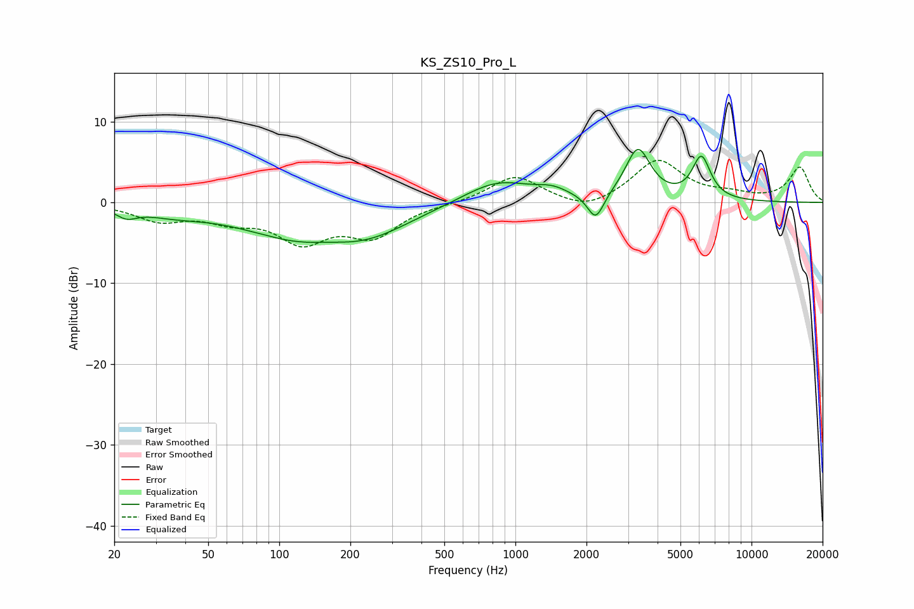

# KS_ZS10_Pro_L
See [usage instructions](https://github.com/jaakkopasanen/AutoEq#usage) for more options and info.

### Parametric EQs
Apply preamp of -6.7 dB when using parametric equalizer.

|   # | Type    |   Fc (Hz) |    Q |   Gain (dB) |
|-----|---------|-----------|------|-------------|
|   1 | Peaking |        23 | 3.3  |        -1.1 |
|   2 | Peaking |        35 | 1.03 |        -1   |
|   3 | Peaking |       142 | 0.52 |        -4.9 |
|   4 | Peaking |       161 | 1.39 |         0.7 |
|   5 | Peaking |       248 | 0.86 |        -1.4 |
|   6 | Peaking |       839 | 0.97 |         2.8 |
|   7 | Peaking |      1435 | 2.07 |         1   |
|   8 | Peaking |      2188 | 4.07 |        -3.3 |
|   9 | Peaking |      3304 | 2.63 |         6.4 |
|  10 | Peaking |      6132 | 3.54 |         5.2 |

### Fixed Band EQs
When using fixed band (also called graphic) equalizer, apply preamp of **-5.3 dB** (if available) and set gains manually with these parameters.

|   # | Type    |   Fc (Hz) |    Q |   Gain (dB) |
|-----|---------|-----------|------|-------------|
|   1 | Peaking |        31 | 1.41 |        -2   |
|   2 | Peaking |        62 | 1.41 |        -1.8 |
|   3 | Peaking |       125 | 1.41 |        -4.4 |
|   4 | Peaking |       250 | 1.41 |        -3.8 |
|   5 | Peaking |       500 | 1.41 |        -0.1 |
|   6 | Peaking |      1000 | 1.41 |         3.3 |
|   7 | Peaking |      2000 | 1.41 |        -1.3 |
|   8 | Peaking |      4000 | 1.41 |         5.2 |
|   9 | Peaking |      8000 | 1.41 |         0.7 |
|  10 | Peaking |     16000 | 1.41 |         4.3 |

### Graphs

