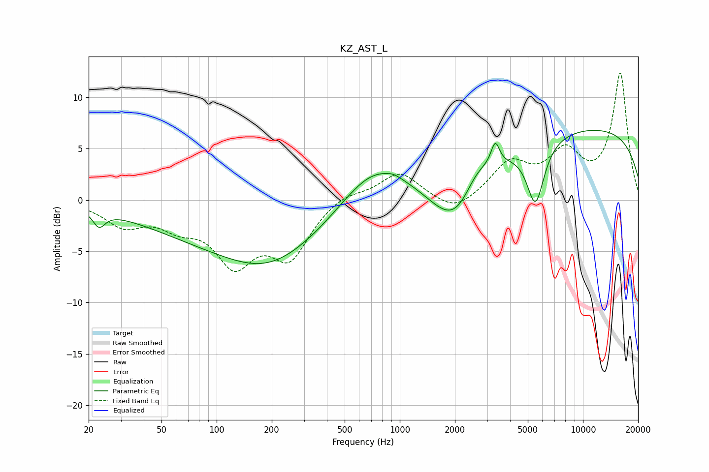

# KZ_AST_L
See [usage instructions](https://github.com/jaakkopasanen/AutoEq#usage) for more options and info.

### Parametric EQs
Apply preamp of -6.9 dB when using parametric equalizer.

|   # | Type    |   Fc (Hz) |    Q |   Gain (dB) |
|-----|---------|-----------|------|-------------|
|   1 | Peaking |        23 | 4.31 |        -1.5 |
|   2 | Peaking |       170 | 0.25 |        -4.5 |
|   3 | Peaking |       191 | 0.65 |        -2.3 |
|   4 | Peaking |       724 | 0.71 |         5.1 |
|   5 | Peaking |       924 | 4.39 |         0.2 |
|   6 | Peaking |      2052 | 0.98 |        -6.2 |
|   7 | Peaking |      2612 | 1.86 |         2.5 |
|   8 | Peaking |      3320 | 6    |         2.3 |
|   9 | Peaking |      5505 | 2.89 |        -6.1 |
|  10 | Peaking |      9641 | 0.19 |         7.1 |

### Fixed Band EQs
When using fixed band (also called graphic) equalizer, apply preamp of **-12.5 dB** (if available) and set gains manually with these parameters.

|   # | Type    |   Fc (Hz) |    Q |   Gain (dB) |
|-----|---------|-----------|------|-------------|
|   1 | Peaking |        31 | 1.41 |        -2.3 |
|   2 | Peaking |        62 | 1.41 |        -1.9 |
|   3 | Peaking |       125 | 1.41 |        -5.6 |
|   4 | Peaking |       250 | 1.41 |        -5.2 |
|   5 | Peaking |       500 | 1.41 |         0.8 |
|   6 | Peaking |      1000 | 1.41 |         2.7 |
|   7 | Peaking |      2000 | 1.41 |        -1.5 |
|   8 | Peaking |      4000 | 1.41 |         3.4 |
|   9 | Peaking |      8000 | 1.41 |         4.1 |
|  10 | Peaking |     16000 | 1.41 |        12.2 |

### Graphs

