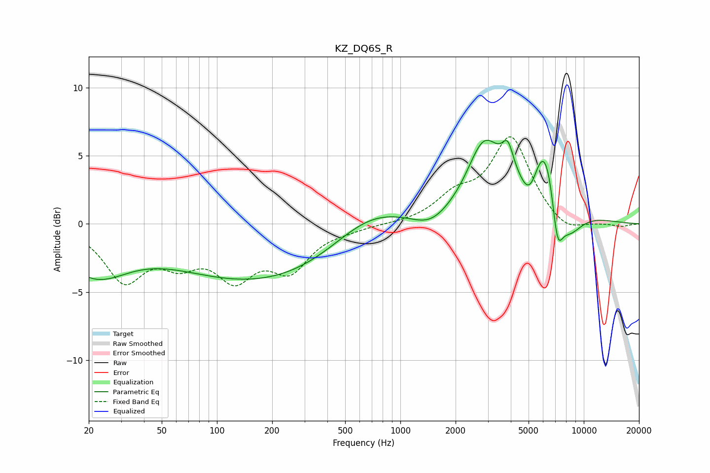

# KZ_DQ6S_R
See [usage instructions](https://github.com/jaakkopasanen/AutoEq#usage) for more options and info.

### Parametric EQs
Apply preamp of -6.2 dB when using parametric equalizer.

|   # | Type    |   Fc (Hz) |    Q |   Gain (dB) |
|-----|---------|-----------|------|-------------|
|   1 | Peaking |        21 | 0.77 |        -3.4 |
|   2 | Peaking |       181 | 0.28 |        -4.2 |
|   3 | Peaking |       672 | 0.66 |         2.3 |
|   4 | Peaking |      1461 | 1.43 |        -1   |
|   5 | Peaking |      2855 | 1.53 |         5   |
|   6 | Peaking |      3851 | 4.54 |         1.9 |
|   7 | Peaking |      5115 | 2.33 |        -4   |
|   8 | Peaking |      6133 | 1.25 |         9.4 |
|   9 | Peaking |      7165 | 4.23 |        -4.3 |
|  10 | Peaking |      8043 | 1.52 |        -4.4 |

### Fixed Band EQs
When using fixed band (also called graphic) equalizer, apply preamp of **-6.5 dB** (if available) and set gains manually with these parameters.

|   # | Type    |   Fc (Hz) |    Q |   Gain (dB) |
|-----|---------|-----------|------|-------------|
|   1 | Peaking |        31 | 1.41 |        -3.9 |
|   2 | Peaking |        62 | 1.41 |        -2.2 |
|   3 | Peaking |       125 | 1.41 |        -3.4 |
|   4 | Peaking |       250 | 1.41 |        -3   |
|   5 | Peaking |       500 | 1.41 |        -0.3 |
|   6 | Peaking |      1000 | 1.41 |        -0   |
|   7 | Peaking |      2000 | 1.41 |         1.7 |
|   8 | Peaking |      4000 | 1.41 |         6.2 |
|   9 | Peaking |      8000 | 1.41 |        -0.9 |
|  10 | Peaking |     16000 | 1.41 |        -0.2 |

### Graphs

