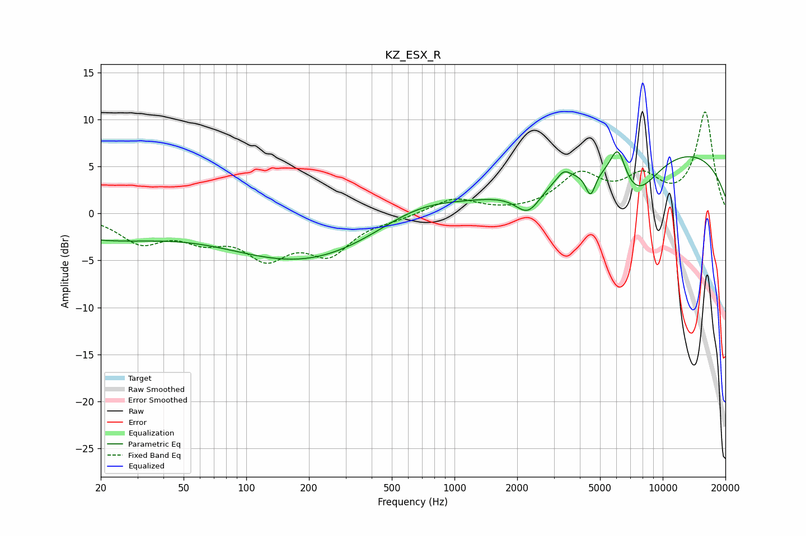

# KZ_ESX_R
See [usage instructions](https://github.com/jaakkopasanen/AutoEq#usage) for more options and info.

### Parametric EQs
Apply preamp of -6.6 dB when using parametric equalizer.

|   # | Type    |   Fc (Hz) |    Q |   Gain (dB) |
|-----|---------|-----------|------|-------------|
|   1 | Peaking |        20 | 0.46 |        -2.5 |
|   2 | Peaking |       192 | 0.37 |        -5.1 |
|   3 | Peaking |       666 | 0.67 |         2.1 |
|   4 | Peaking |      2258 | 2.27 |        -2.8 |
|   5 | Peaking |      3343 | 4.42 |         1   |
|   6 | Peaking |      4501 | 5.98 |        -2.5 |
|   7 | Peaking |      4673 | 0.27 |         0.3 |
|   8 | Peaking |      6094 | 3.59 |         3.8 |
|   9 | Peaking |      7413 | 1.17 |        -4.9 |
|  10 | Peaking |     10000 | 0.23 |         7   |

### Fixed Band EQs
When using fixed band (also called graphic) equalizer, apply preamp of **-10.9 dB** (if available) and set gains manually with these parameters.

|   # | Type    |   Fc (Hz) |    Q |   Gain (dB) |
|-----|---------|-----------|------|-------------|
|   1 | Peaking |        31 | 1.41 |        -2.8 |
|   2 | Peaking |        62 | 1.41 |        -2.2 |
|   3 | Peaking |       125 | 1.41 |        -4.1 |
|   4 | Peaking |       250 | 1.41 |        -3.9 |
|   5 | Peaking |       500 | 1.41 |        -0.4 |
|   6 | Peaking |      1000 | 1.41 |         1.6 |
|   7 | Peaking |      2000 | 1.41 |        -0   |
|   8 | Peaking |      4000 | 1.41 |         3.8 |
|   9 | Peaking |      8000 | 1.41 |         3.3 |
|  10 | Peaking |     16000 | 1.41 |        10.7 |

### Graphs

