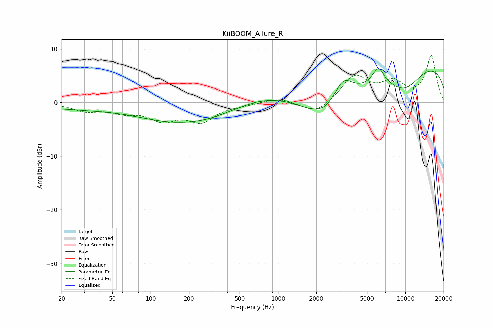

# KiiBOOM_Allure_R
See [usage instructions](https://github.com/jaakkopasanen/AutoEq#usage) for more options and info.

### Parametric EQs
Apply preamp of -6.4 dB when using parametric equalizer.

|   # | Type    |   Fc (Hz) |    Q |   Gain (dB) |
|-----|---------|-----------|------|-------------|
|   1 | Peaking |        63 | 0.18 |        -1.4 |
|   2 | Peaking |       106 | 4.13 |         0   |
|   3 | Peaking |       128 | 0.69 |        -1   |
|   4 | Peaking |       307 | 0.48 |        -3.7 |
|   5 | Peaking |       715 | 0.36 |         3.3 |
|   6 | Peaking |      2638 | 0.63 |        -9.2 |
|   7 | Peaking |      3218 | 1.63 |         6.2 |
|   8 | Peaking |      6140 | 3    |         3.2 |
|   9 | Peaking |      9795 | 0.86 |        -4.7 |
|  10 | Peaking |     10000 | 0.18 |         8.2 |

### Fixed Band EQs
When using fixed band (also called graphic) equalizer, apply preamp of **-8.9 dB** (if available) and set gains manually with these parameters.

|   # | Type    |   Fc (Hz) |    Q |   Gain (dB) |
|-----|---------|-----------|------|-------------|
|   1 | Peaking |        31 | 1.41 |        -1.4 |
|   2 | Peaking |        62 | 1.41 |        -1.5 |
|   3 | Peaking |       125 | 1.41 |        -2.9 |
|   4 | Peaking |       250 | 1.41 |        -3.2 |
|   5 | Peaking |       500 | 1.41 |        -0.3 |
|   6 | Peaking |      1000 | 1.41 |         0.9 |
|   7 | Peaking |      2000 | 1.41 |        -2.2 |
|   8 | Peaking |      4000 | 1.41 |         4.9 |
|   9 | Peaking |      8000 | 1.41 |         3.4 |
|  10 | Peaking |     16000 | 1.41 |         8.6 |

### Graphs

