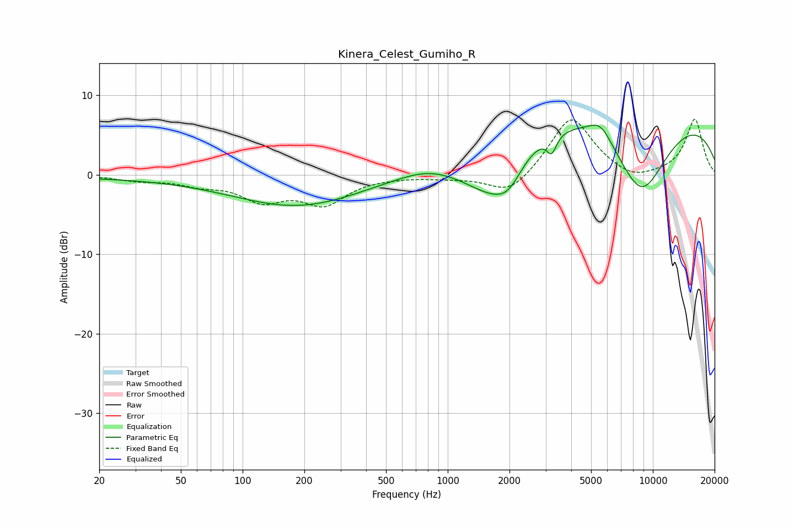

# Kinera_Celest_Gumiho_R
See [usage instructions](https://github.com/jaakkopasanen/AutoEq#usage) for more options and info.

### Parametric EQs
Apply preamp of -6.3 dB when using parametric equalizer.

|   # | Type    |   Fc (Hz) |    Q |   Gain (dB) |
|-----|---------|-----------|------|-------------|
|   1 | Peaking |        26 | 0.31 |        -0.3 |
|   2 | Peaking |       186 | 0.45 |        -3.9 |
|   3 | Peaking |       784 | 1.17 |         0.6 |
|   4 | Peaking |      1344 | 1.73 |         0.5 |
|   5 | Peaking |      1503 | 0.99 |        -5.8 |
|   6 | Peaking |      1965 | 1.82 |        -3.9 |
|   7 | Peaking |      3211 | 5.95 |        -2.3 |
|   8 | Peaking |      5559 | 2.37 |         2.3 |
|   9 | Peaking |      7220 | 0.18 |        11   |
|  10 | Peaking |      8778 | 0.83 |       -12.4 |

### Fixed Band EQs
When using fixed band (also called graphic) equalizer, apply preamp of **-7.1 dB** (if available) and set gains manually with these parameters.

|   # | Type    |   Fc (Hz) |    Q |   Gain (dB) |
|-----|---------|-----------|------|-------------|
|   1 | Peaking |        31 | 1.41 |        -0.6 |
|   2 | Peaking |        62 | 1.41 |        -1   |
|   3 | Peaking |       125 | 1.41 |        -2.9 |
|   4 | Peaking |       250 | 1.41 |        -3.4 |
|   5 | Peaking |       500 | 1.41 |        -0.1 |
|   6 | Peaking |      1000 | 1.41 |        -0.3 |
|   7 | Peaking |      2000 | 1.41 |        -2.7 |
|   8 | Peaking |      4000 | 1.41 |         7.5 |
|   9 | Peaking |      8000 | 1.41 |        -1.1 |
|  10 | Peaking |     16000 | 1.41 |         7   |

### Graphs

