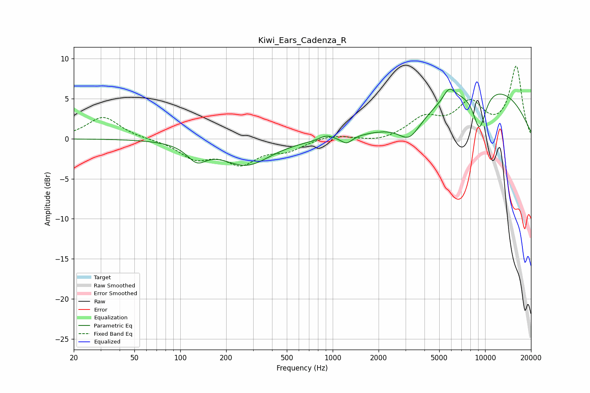

# Kiwi_Ears_Cadenza_R
See [usage instructions](https://github.com/jaakkopasanen/AutoEq#usage) for more options and info.

### Parametric EQs
Apply preamp of -6.3 dB when using parametric equalizer.

|   # | Type    |   Fc (Hz) |    Q |   Gain (dB) |
|-----|---------|-----------|------|-------------|
|   1 | Peaking |       128 | 2.22 |        -2   |
|   2 | Peaking |       271 | 0.9  |        -3.2 |
|   3 | Peaking |       907 | 3.39 |         0.5 |
|   4 | Peaking |      1235 | 3.91 |        -0.9 |
|   5 | Peaking |      3220 | 2.03 |        -3.3 |
|   6 | Peaking |      3295 | 2.55 |         0.6 |
|   7 | Peaking |      5811 | 3.62 |         1.9 |
|   8 | Peaking |      5828 | 3.69 |        -0.3 |
|   9 | Peaking |      9179 | 2.88 |        -5   |
|  10 | Peaking |      9877 | 0.33 |         6.6 |

### Fixed Band EQs
When using fixed band (also called graphic) equalizer, apply preamp of **-9.2 dB** (if available) and set gains manually with these parameters.

|   # | Type    |   Fc (Hz) |    Q |   Gain (dB) |
|-----|---------|-----------|------|-------------|
|   1 | Peaking |        31 | 1.41 |         2.8 |
|   2 | Peaking |        62 | 1.41 |        -0   |
|   3 | Peaking |       125 | 1.41 |        -2.3 |
|   4 | Peaking |       250 | 1.41 |        -2.8 |
|   5 | Peaking |       500 | 1.41 |        -1.3 |
|   6 | Peaking |      1000 | 1.41 |         0.6 |
|   7 | Peaking |      2000 | 1.41 |        -0.5 |
|   8 | Peaking |      4000 | 1.41 |         2.4 |
|   9 | Peaking |      8000 | 1.41 |         4.1 |
|  10 | Peaking |     16000 | 1.41 |         8.9 |

### Graphs

