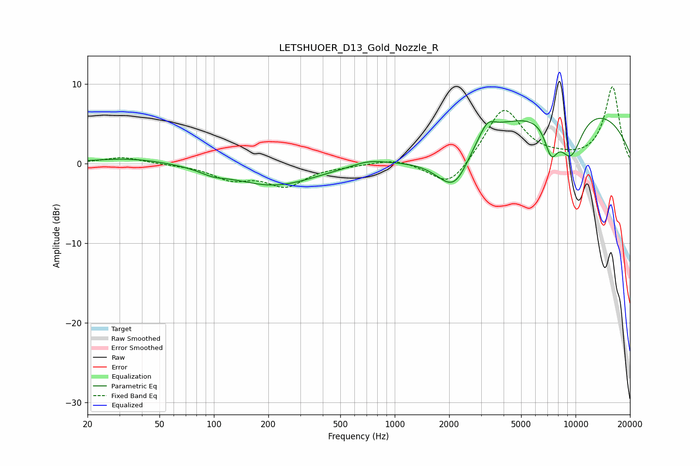

# LETSHUOER_D13_Gold_Nozzle_R
See [usage instructions](https://github.com/jaakkopasanen/AutoEq#usage) for more options and info.

### Parametric EQs
Apply preamp of -5.8 dB when using parametric equalizer.

|   # | Type    |   Fc (Hz) |    Q |   Gain (dB) |
|-----|---------|-----------|------|-------------|
|   1 | Peaking |        35 | 0.67 |         0.7 |
|   2 | Peaking |        99 | 2.03 |        -0.6 |
|   3 | Peaking |       214 | 0.62 |        -2.7 |
|   4 | Peaking |       716 | 1.53 |         0.7 |
|   5 | Peaking |      2165 | 1.37 |        -6.8 |
|   6 | Peaking |      2807 | 1.12 |         2.4 |
|   7 | Peaking |      3259 | 3.65 |         1.5 |
|   8 | Peaking |      7336 | 3.66 |        -3.9 |
|   9 | Peaking |      9321 | 0.26 |         7.5 |
|  10 | Peaking |      9399 | 1.87 |        -5.9 |

### Fixed Band EQs
When using fixed band (also called graphic) equalizer, apply preamp of **-9.7 dB** (if available) and set gains manually with these parameters.

|   # | Type    |   Fc (Hz) |    Q |   Gain (dB) |
|-----|---------|-----------|------|-------------|
|   1 | Peaking |        31 | 1.41 |         0.8 |
|   2 | Peaking |        62 | 1.41 |        -0.1 |
|   3 | Peaking |       125 | 1.41 |        -1.8 |
|   4 | Peaking |       250 | 1.41 |        -2.6 |
|   5 | Peaking |       500 | 1.41 |        -0.2 |
|   6 | Peaking |      1000 | 1.41 |         0.7 |
|   7 | Peaking |      2000 | 1.41 |        -3.3 |
|   8 | Peaking |      4000 | 1.41 |         7   |
|   9 | Peaking |      8000 | 1.41 |         0.3 |
|  10 | Peaking |     16000 | 1.41 |         9.6 |

### Graphs

