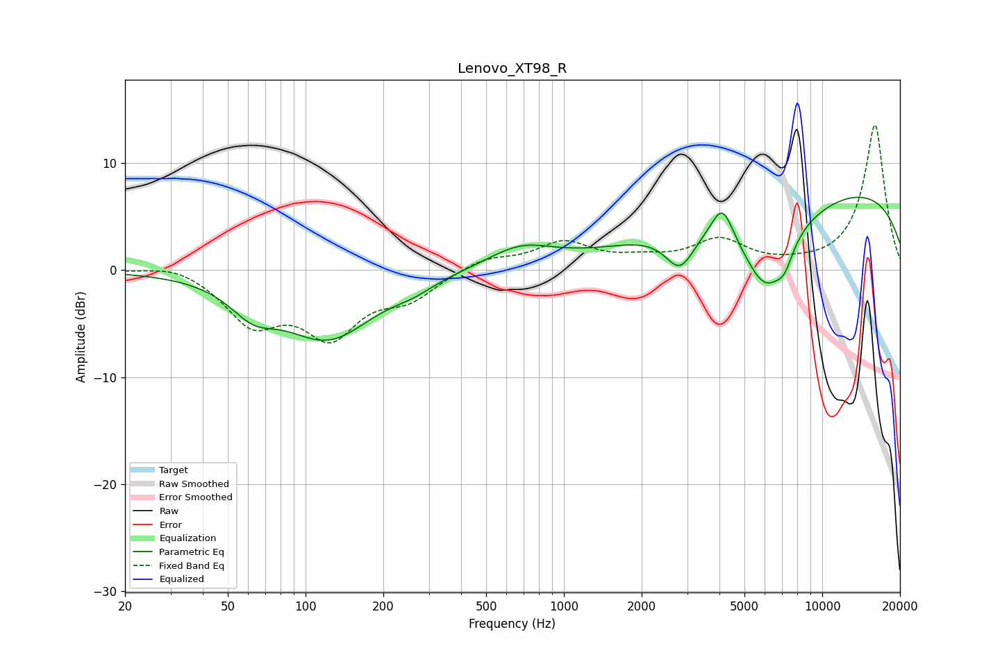

# Lenovo_XT98_R
See [usage instructions](https://github.com/jaakkopasanen/AutoEq#usage) for more options and info.

### Parametric EQs
Apply preamp of -6.9 dB when using parametric equalizer.

|   # | Type    |   Fc (Hz) |    Q |   Gain (dB) |
|-----|---------|-----------|------|-------------|
|   1 | Peaking |        63 | 1.61 |        -2.4 |
|   2 | Peaking |       122 | 0.79 |        -6.2 |
|   3 | Peaking |       261 | 1.89 |        -0.7 |
|   4 | Peaking |       679 | 1.08 |         2.1 |
|   5 | Peaking |      2816 | 2.45 |        -3.6 |
|   6 | Peaking |      4106 | 3.39 |         3.2 |
|   7 | Peaking |      6051 | 1.37 |        -8.1 |
|   8 | Peaking |      7148 | 4.13 |        -1.6 |
|   9 | Peaking |      9967 | 1.01 |        -0.5 |
|  10 | Peaking |      9992 | 0.2  |         8   |

### Fixed Band EQs
When using fixed band (also called graphic) equalizer, apply preamp of **-13.7 dB** (if available) and set gains manually with these parameters.

|   # | Type    |   Fc (Hz) |    Q |   Gain (dB) |
|-----|---------|-----------|------|-------------|
|   1 | Peaking |        31 | 1.41 |         0.8 |
|   2 | Peaking |        62 | 1.41 |        -4.6 |
|   3 | Peaking |       125 | 1.41 |        -5.6 |
|   4 | Peaking |       250 | 1.41 |        -2.3 |
|   5 | Peaking |       500 | 1.41 |         1.1 |
|   6 | Peaking |      1000 | 1.41 |         2.5 |
|   7 | Peaking |      2000 | 1.41 |         0.8 |
|   8 | Peaking |      4000 | 1.41 |         2.6 |
|   9 | Peaking |      8000 | 1.41 |         0.2 |
|  10 | Peaking |     16000 | 1.41 |        13.6 |

### Graphs

