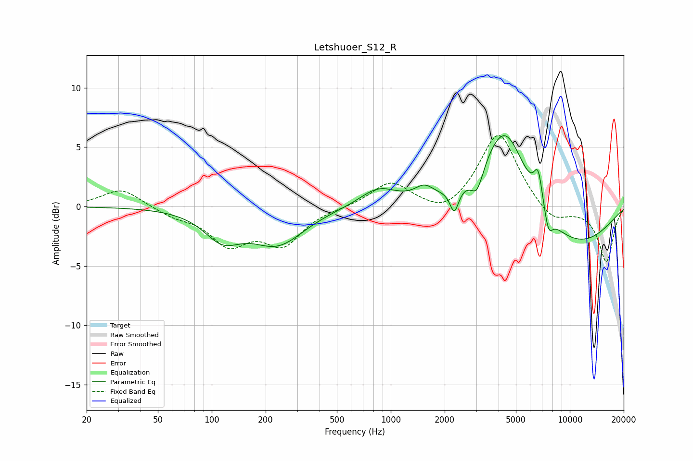

# Letshuoer_S12_R
See [usage instructions](https://github.com/jaakkopasanen/AutoEq#usage) for more options and info.

### Parametric EQs
Apply preamp of -6.1 dB when using parametric equalizer.

|   # | Type    |   Fc (Hz) |    Q |   Gain (dB) |
|-----|---------|-----------|------|-------------|
|   1 | Peaking |       115 | 1.39 |        -2.3 |
|   2 | Peaking |       233 | 0.95 |        -3   |
|   3 | Peaking |       851 | 1.36 |         1.5 |
|   4 | Peaking |      1537 | 2.71 |         1   |
|   5 | Peaking |      2264 | 5.85 |        -2   |
|   6 | Peaking |      3034 | 4.08 |        -2   |
|   7 | Peaking |      4340 | 1.11 |         7.8 |
|   8 | Peaking |      6662 | 5.45 |         2.8 |
|   9 | Peaking |      7599 | 5.65 |        -1.7 |
|  10 | Peaking |      9873 | 0.45 |        -3.6 |

### Fixed Band EQs
When using fixed band (also called graphic) equalizer, apply preamp of **-6.1 dB** (if available) and set gains manually with these parameters.

|   # | Type    |   Fc (Hz) |    Q |   Gain (dB) |
|-----|---------|-----------|------|-------------|
|   1 | Peaking |        31 | 1.41 |         1.6 |
|   2 | Peaking |        62 | 1.41 |        -0.7 |
|   3 | Peaking |       125 | 1.41 |        -2.9 |
|   4 | Peaking |       250 | 1.41 |        -3   |
|   5 | Peaking |       500 | 1.41 |        -0.1 |
|   6 | Peaking |      1000 | 1.41 |         2.1 |
|   7 | Peaking |      2000 | 1.41 |        -1   |
|   8 | Peaking |      4000 | 1.41 |         6.3 |
|   9 | Peaking |      8000 | 1.41 |        -1.4 |
|  10 | Peaking |     16000 | 1.41 |        -4.6 |

### Graphs

