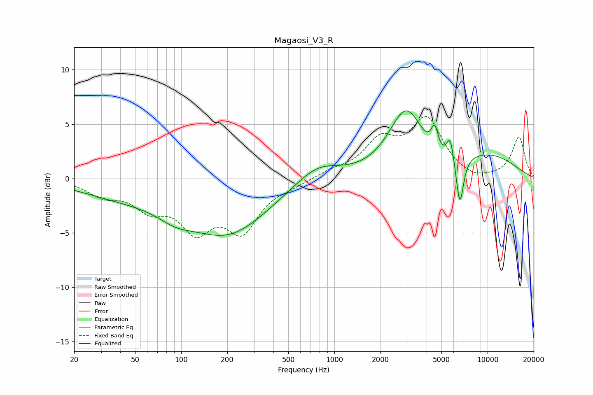

# Magaosi_V3_R
See [usage instructions](https://github.com/jaakkopasanen/AutoEq#usage) for more options and info.

### Parametric EQs
Apply preamp of -6.3 dB when using parametric equalizer.

|   # | Type    |   Fc (Hz) |    Q |   Gain (dB) |
|-----|---------|-----------|------|-------------|
|   1 | Peaking |        42 | 0.49 |        -1.5 |
|   2 | Peaking |        92 | 1.2  |        -1.1 |
|   3 | Peaking |       202 | 0.54 |        -4.9 |
|   4 | Peaking |       775 | 1    |         1.7 |
|   5 | Peaking |      2937 | 1.26 |         5.9 |
|   6 | Peaking |      4518 | 6    |         2.2 |
|   7 | Peaking |      4722 | 1.44 |        -0.7 |
|   8 | Peaking |      5705 | 6    |         2.2 |
|   9 | Peaking |      6593 | 5.56 |        -4.5 |
|  10 | Peaking |     10000 | 0.54 |         2   |

### Fixed Band EQs
When using fixed band (also called graphic) equalizer, apply preamp of **-5.8 dB** (if available) and set gains manually with these parameters.

|   # | Type    |   Fc (Hz) |    Q |   Gain (dB) |
|-----|---------|-----------|------|-------------|
|   1 | Peaking |        31 | 1.41 |        -1.3 |
|   2 | Peaking |        62 | 1.41 |        -2.3 |
|   3 | Peaking |       125 | 1.41 |        -4.1 |
|   4 | Peaking |       250 | 1.41 |        -4.4 |
|   5 | Peaking |       500 | 1.41 |        -0.5 |
|   6 | Peaking |      1000 | 1.41 |         0.6 |
|   7 | Peaking |      2000 | 1.41 |         3.1 |
|   8 | Peaking |      4000 | 1.41 |         5.2 |
|   9 | Peaking |      8000 | 1.41 |        -0.4 |
|  10 | Peaking |     16000 | 1.41 |         3.8 |

### Graphs

