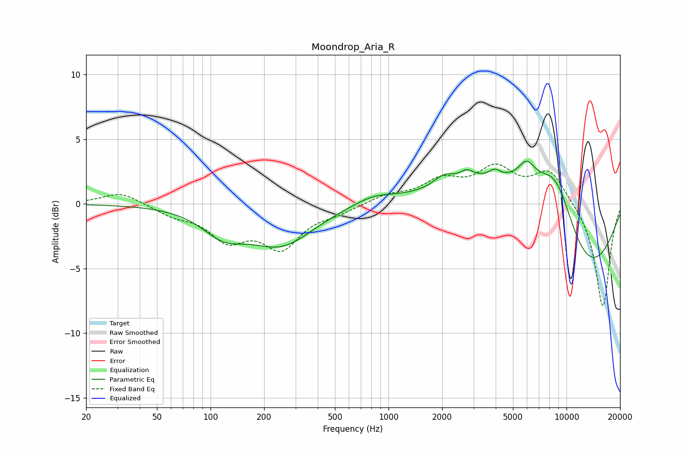

# Moondrop_Aria_R
See [usage instructions](https://github.com/jaakkopasanen/AutoEq#usage) for more options and info.

### Parametric EQs
Apply preamp of -3.4 dB when using parametric equalizer.

|   # | Type    |   Fc (Hz) |    Q |   Gain (dB) |
|-----|---------|-----------|------|-------------|
|   1 | Peaking |       118 | 1.17 |        -1.8 |
|   2 | Peaking |       250 | 0.78 |        -3   |
|   3 | Peaking |       823 | 1.2  |         0.7 |
|   4 | Peaking |      2048 | 2.51 |         0.8 |
|   5 | Peaking |      2751 | 3.82 |         0.6 |
|   6 | Peaking |      3948 | 4.63 |         0.5 |
|   7 | Peaking |      4909 | 0.47 |         5   |
|   8 | Peaking |      5970 | 2.87 |         1.6 |
|   9 | Peaking |      8732 | 0.99 |         7   |
|  10 | Peaking |     10000 | 0.4  |        -9.1 |

### Fixed Band EQs
When using fixed band (also called graphic) equalizer, apply preamp of **-3.2 dB** (if available) and set gains manually with these parameters.

|   # | Type    |   Fc (Hz) |    Q |   Gain (dB) |
|-----|---------|-----------|------|-------------|
|   1 | Peaking |        31 | 1.41 |         1   |
|   2 | Peaking |        62 | 1.41 |        -0.7 |
|   3 | Peaking |       125 | 1.41 |        -2.5 |
|   4 | Peaking |       250 | 1.41 |        -3.1 |
|   5 | Peaking |       500 | 1.41 |        -0.6 |
|   6 | Peaking |      1000 | 1.41 |         0.6 |
|   7 | Peaking |      2000 | 1.41 |         1.6 |
|   8 | Peaking |      4000 | 1.41 |         2.5 |
|   9 | Peaking |      8000 | 1.41 |         2.6 |
|  10 | Peaking |     16000 | 1.41 |        -8.1 |

### Graphs

