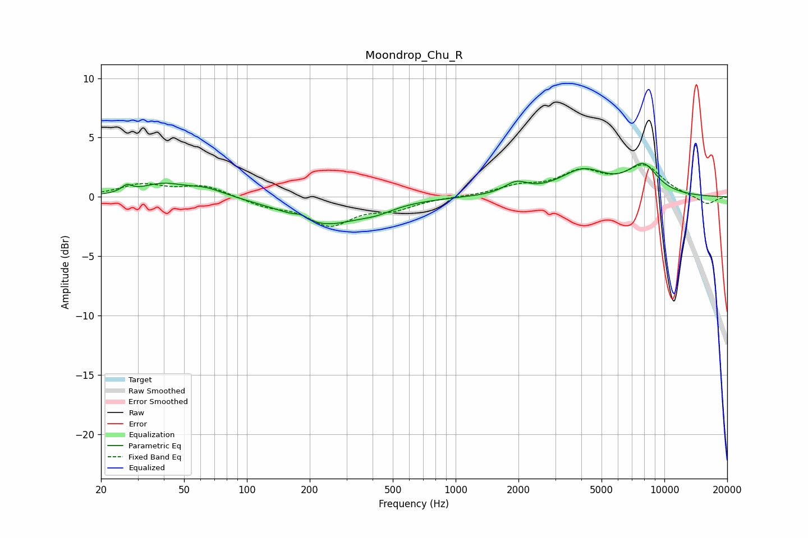

# Moondrop_Chu_R
See [usage instructions](https://github.com/jaakkopasanen/AutoEq#usage) for more options and info.

### Parametric EQs
Apply preamp of -2.9 dB when using parametric equalizer.

|   # | Type    |   Fc (Hz) |    Q |   Gain (dB) |
|-----|---------|-----------|------|-------------|
|   1 | Peaking |        27 | 5.91 |         0.6 |
|   2 | Peaking |        39 | 1.38 |         1   |
|   3 | Peaking |        64 | 1.53 |         0.7 |
|   4 | Peaking |       182 | 4.64 |         0.3 |
|   5 | Peaking |       235 | 0.83 |        -2.2 |
|   6 | Peaking |       418 | 1.61 |        -0.5 |
|   7 | Peaking |      1946 | 2.58 |         0.9 |
|   8 | Peaking |      4082 | 1.26 |         2.1 |
|   9 | Peaking |      7543 | 2.57 |        -0.7 |
|  10 | Peaking |      7789 | 1.94 |         3.1 |

### Fixed Band EQs
When using fixed band (also called graphic) equalizer, apply preamp of **-2.8 dB** (if available) and set gains manually with these parameters.

|   # | Type    |   Fc (Hz) |    Q |   Gain (dB) |
|-----|---------|-----------|------|-------------|
|   1 | Peaking |        31 | 1.41 |         1   |
|   2 | Peaking |        62 | 1.41 |         0.9 |
|   3 | Peaking |       125 | 1.41 |        -0.7 |
|   4 | Peaking |       250 | 1.41 |        -2.3 |
|   5 | Peaking |       500 | 1.41 |        -0.9 |
|   6 | Peaking |      1000 | 1.41 |         0   |
|   7 | Peaking |      2000 | 1.41 |         0.8 |
|   8 | Peaking |      4000 | 1.41 |         1.9 |
|   9 | Peaking |      8000 | 1.41 |         2.4 |
|  10 | Peaking |     16000 | 1.41 |        -0.7 |

### Graphs

