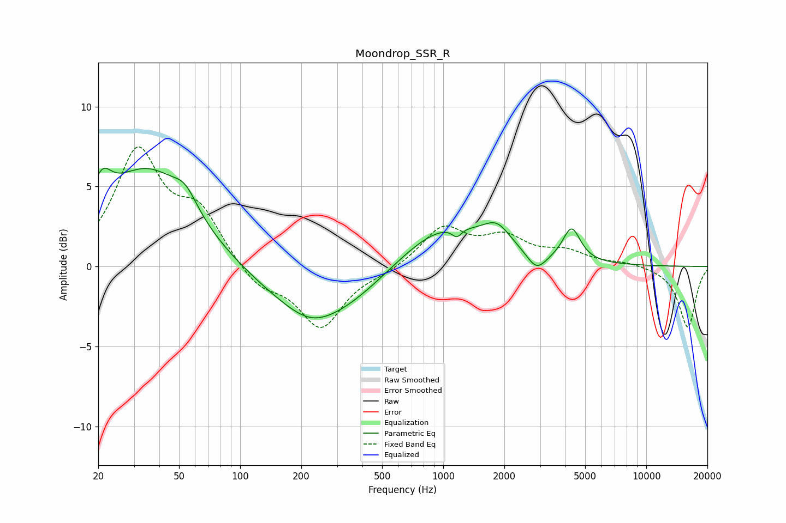

# Moondrop_SSR_R
See [usage instructions](https://github.com/jaakkopasanen/AutoEq#usage) for more options and info.

### Parametric EQs
Apply preamp of -6.2 dB when using parametric equalizer.

|   # | Type    |   Fc (Hz) |    Q |   Gain (dB) |
|-----|---------|-----------|------|-------------|
|   1 | Peaking |        21 | 3.01 |         2.1 |
|   2 | Peaking |        35 | 0.65 |         6   |
|   3 | Peaking |        54 | 2.46 |         1.2 |
|   4 | Peaking |       222 | 1.27 |        -0.6 |
|   5 | Peaking |       255 | 0.5  |        -3.4 |
|   6 | Peaking |       997 | 0.6  |         2.9 |
|   7 | Peaking |      1167 | 5.85 |        -0.6 |
|   8 | Peaking |      1841 | 2.15 |         1.3 |
|   9 | Peaking |      2883 | 2.89 |        -1.2 |
|  10 | Peaking |      4288 | 3.26 |         2.1 |

### Fixed Band EQs
When using fixed band (also called graphic) equalizer, apply preamp of **-7.6 dB** (if available) and set gains manually with these parameters.

|   # | Type    |   Fc (Hz) |    Q |   Gain (dB) |
|-----|---------|-----------|------|-------------|
|   1 | Peaking |        31 | 1.41 |         7   |
|   2 | Peaking |        62 | 1.41 |         3.1 |
|   3 | Peaking |       125 | 1.41 |        -1.4 |
|   4 | Peaking |       250 | 1.41 |        -3.8 |
|   5 | Peaking |       500 | 1.41 |        -0.3 |
|   6 | Peaking |      1000 | 1.41 |         2.4 |
|   7 | Peaking |      2000 | 1.41 |         1.6 |
|   8 | Peaking |      4000 | 1.41 |         0.8 |
|   9 | Peaking |      8000 | 1.41 |         0.2 |
|  10 | Peaking |     16000 | 1.41 |        -3.8 |

### Graphs

