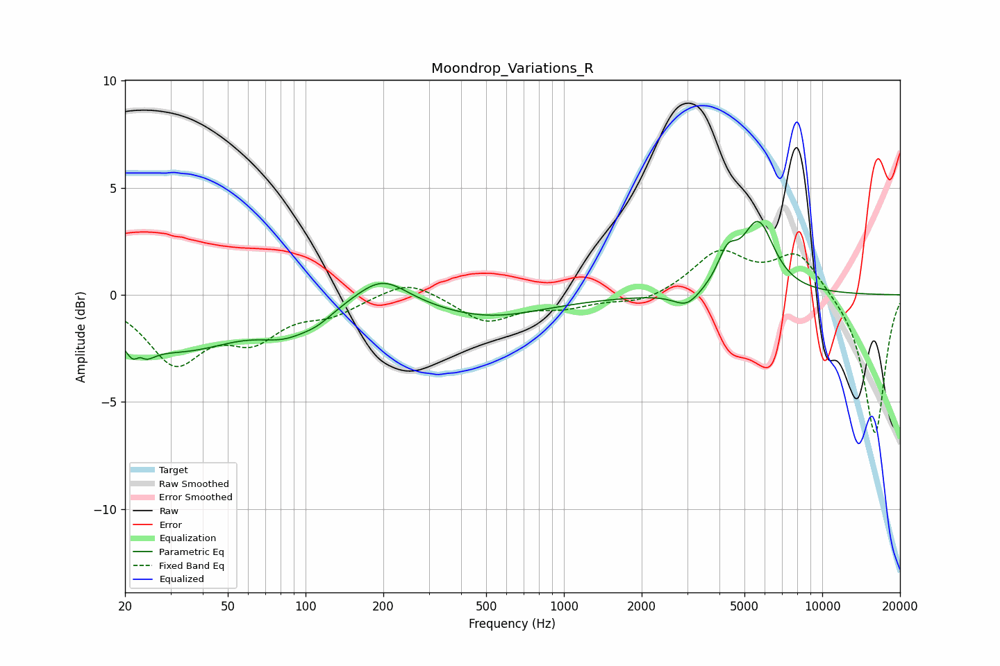

# Moondrop_Variations_R
See [usage instructions](https://github.com/jaakkopasanen/AutoEq#usage) for more options and info.

### Parametric EQs
Apply preamp of -3.5 dB when using parametric equalizer.

|   # | Type    |   Fc (Hz) |    Q |   Gain (dB) |
|-----|---------|-----------|------|-------------|
|   1 | Peaking |        23 | 4.13 |        -2.9 |
|   2 | Peaking |        23 | 5.66 |         2   |
|   3 | Peaking |        33 | 0.59 |        -2.4 |
|   4 | Peaking |        83 | 1.34 |        -1   |
|   5 | Peaking |       111 | 2.18 |        -0.4 |
|   6 | Peaking |       198 | 1.44 |         1.3 |
|   7 | Peaking |       508 | 0.63 |        -1   |
|   8 | Peaking |      2996 | 2.72 |        -0.7 |
|   9 | Peaking |      4292 | 3.71 |         1.4 |
|  10 | Peaking |      5653 | 2.23 |         3.3 |

### Fixed Band EQs
When using fixed band (also called graphic) equalizer, apply preamp of **-2.2 dB** (if available) and set gains manually with these parameters.

|   # | Type    |   Fc (Hz) |    Q |   Gain (dB) |
|-----|---------|-----------|------|-------------|
|   1 | Peaking |        31 | 1.41 |        -3   |
|   2 | Peaking |        62 | 1.41 |        -1.8 |
|   3 | Peaking |       125 | 1.41 |        -0.8 |
|   4 | Peaking |       250 | 1.41 |         0.8 |
|   5 | Peaking |       500 | 1.41 |        -1.2 |
|   6 | Peaking |      1000 | 1.41 |        -0.5 |
|   7 | Peaking |      2000 | 1.41 |        -0.4 |
|   8 | Peaking |      4000 | 1.41 |         1.9 |
|   9 | Peaking |      8000 | 1.41 |         2   |
|  10 | Peaking |     16000 | 1.41 |        -6.6 |

### Graphs

