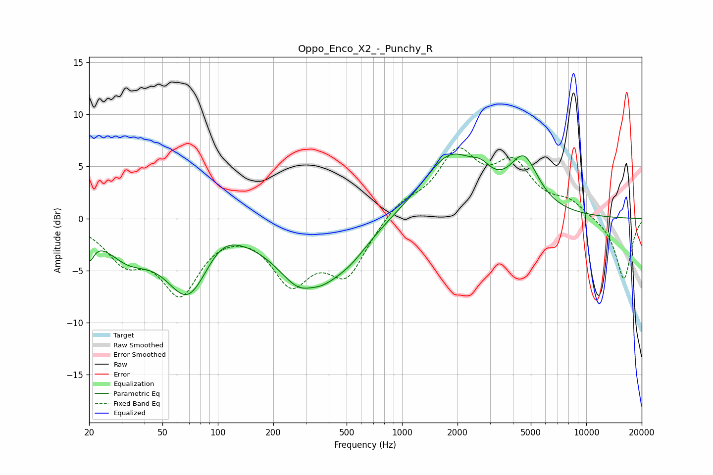

# Oppo_Enco_X2_-_Punchy_R
See [usage instructions](https://github.com/jaakkopasanen/AutoEq#usage) for more options and info.

### Parametric EQs
Apply preamp of -6.3 dB when using parametric equalizer.

|   # | Type    |   Fc (Hz) |    Q |   Gain (dB) |
|-----|---------|-----------|------|-------------|
|   1 | Peaking |        20 | 5.6  |        -2.3 |
|   2 | Peaking |        32 | 1.15 |        -2.9 |
|   3 | Peaking |        69 | 1.16 |        -6.9 |
|   4 | Peaking |       104 | 1.39 |         1.8 |
|   5 | Peaking |       306 | 0.98 |        -7.2 |
|   6 | Peaking |       317 | 2.24 |         1.2 |
|   7 | Peaking |       522 | 1.19 |        -2   |
|   8 | Peaking |      1831 | 0.93 |         6   |
|   9 | Peaking |      2689 | 2.71 |         1.2 |
|  10 | Peaking |      4593 | 1.79 |         4.8 |

### Fixed Band EQs
When using fixed band (also called graphic) equalizer, apply preamp of **-6.9 dB** (if available) and set gains manually with these parameters.

|   # | Type    |   Fc (Hz) |    Q |   Gain (dB) |
|-----|---------|-----------|------|-------------|
|   1 | Peaking |        31 | 1.41 |        -3.5 |
|   2 | Peaking |        62 | 1.41 |        -6.6 |
|   3 | Peaking |       125 | 1.41 |        -0.1 |
|   4 | Peaking |       250 | 1.41 |        -5.6 |
|   5 | Peaking |       500 | 1.41 |        -5.1 |
|   6 | Peaking |      1000 | 1.41 |         1.5 |
|   7 | Peaking |      2000 | 1.41 |         5.9 |
|   8 | Peaking |      4000 | 1.41 |         4.6 |
|   9 | Peaking |      8000 | 1.41 |         1.4 |
|  10 | Peaking |     16000 | 1.41 |        -5.9 |

### Graphs

