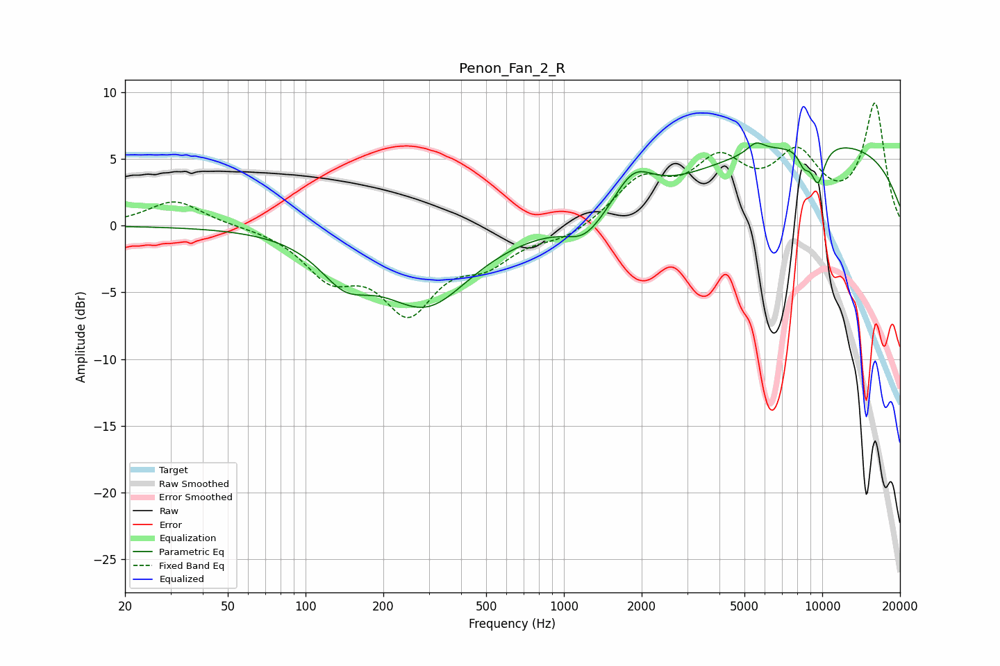

# Penon_Fan_2_R
See [usage instructions](https://github.com/jaakkopasanen/AutoEq#usage) for more options and info.

### Parametric EQs
Apply preamp of -6.3 dB when using parametric equalizer.

|   # | Type    |   Fc (Hz) |    Q |   Gain (dB) |
|-----|---------|-----------|------|-------------|
|   1 | Peaking |       142 | 1.42 |        -2.8 |
|   2 | Peaking |       293 | 0.82 |        -5.7 |
|   3 | Peaking |      1221 | 1.93 |        -1.9 |
|   4 | Peaking |      1259 | 3.1  |         0.2 |
|   5 | Peaking |      1859 | 1.88 |         2.6 |
|   6 | Peaking |      5536 | 4.29 |         0.8 |
|   7 | Peaking |      8486 | 5.96 |        -1.1 |
|   8 | Peaking |      9541 | 5.79 |         1.6 |
|   9 | Peaking |      9585 | 4.97 |        -4.5 |
|  10 | Peaking |      9858 | 0.24 |         6.2 |

### Fixed Band EQs
When using fixed band (also called graphic) equalizer, apply preamp of **-9.3 dB** (if available) and set gains manually with these parameters.

|   # | Type    |   Fc (Hz) |    Q |   Gain (dB) |
|-----|---------|-----------|------|-------------|
|   1 | Peaking |        31 | 1.41 |         1.9 |
|   2 | Peaking |        62 | 1.41 |         0   |
|   3 | Peaking |       125 | 1.41 |        -3.4 |
|   4 | Peaking |       250 | 1.41 |        -5.9 |
|   5 | Peaking |       500 | 1.41 |        -2.3 |
|   6 | Peaking |      1000 | 1.41 |        -0.9 |
|   7 | Peaking |      2000 | 1.41 |         3.2 |
|   8 | Peaking |      4000 | 1.41 |         4.2 |
|   9 | Peaking |      8000 | 1.41 |         4.7 |
|  10 | Peaking |     16000 | 1.41 |         9   |

### Graphs

