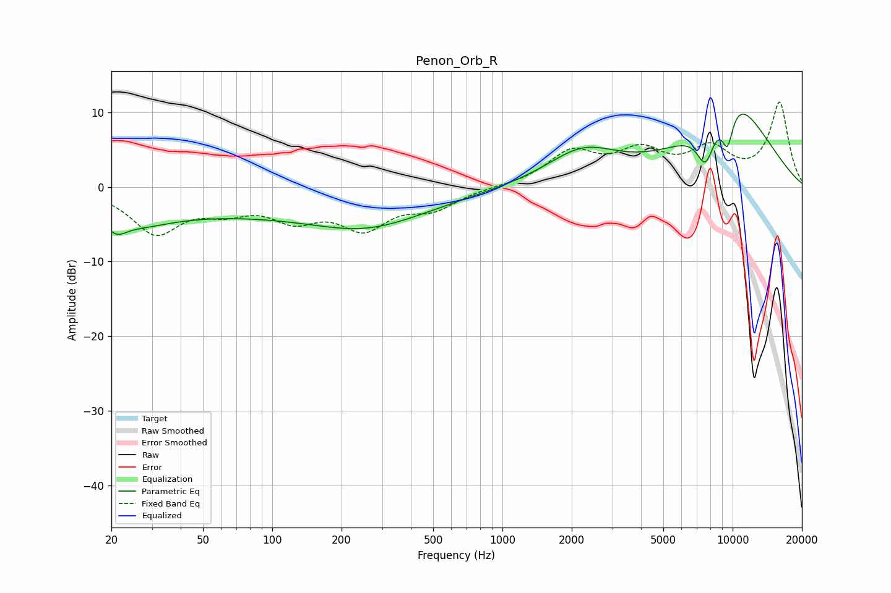

# Penon_Orb_R
See [usage instructions](https://github.com/jaakkopasanen/AutoEq#usage) for more options and info.

### Parametric EQs
Apply preamp of -9.9 dB when using parametric equalizer.

|   # | Type    |   Fc (Hz) |    Q |   Gain (dB) |
|-----|---------|-----------|------|-------------|
|   1 | Peaking |        21 | 3.21 |        -2   |
|   2 | Peaking |        22 | 1.57 |         0.4 |
|   3 | Peaking |        24 | 0.9  |        -3.1 |
|   4 | Peaking |        46 | 0.18 |         0.6 |
|   5 | Peaking |        99 | 0.18 |        -3.9 |
|   6 | Peaking |       258 | 0.63 |        -2.5 |
|   7 | Peaking |      2227 | 0.9  |         4.5 |
|   8 | Peaking |      7628 | 3.35 |        -5.4 |
|   9 | Peaking |      9498 | 4.85 |        -5   |
|  10 | Peaking |     10000 | 0.68 |        11.5 |

### Fixed Band EQs
When using fixed band (also called graphic) equalizer, apply preamp of **-11.5 dB** (if available) and set gains manually with these parameters.

|   # | Type    |   Fc (Hz) |    Q |   Gain (dB) |
|-----|---------|-----------|------|-------------|
|   1 | Peaking |        31 | 1.41 |        -5.9 |
|   2 | Peaking |        62 | 1.41 |        -2.4 |
|   3 | Peaking |       125 | 1.41 |        -3.6 |
|   4 | Peaking |       250 | 1.41 |        -5   |
|   5 | Peaking |       500 | 1.41 |        -2.5 |
|   6 | Peaking |      1000 | 1.41 |         0   |
|   7 | Peaking |      2000 | 1.41 |         4.4 |
|   8 | Peaking |      4000 | 1.41 |         4.2 |
|   9 | Peaking |      8000 | 1.41 |         4.5 |
|  10 | Peaking |     16000 | 1.41 |        11.2 |

### Graphs

