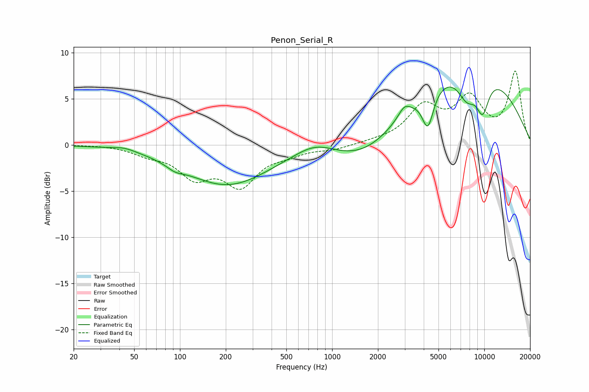

# Penon_Serial_R
See [usage instructions](https://github.com/jaakkopasanen/AutoEq#usage) for more options and info.

### Parametric EQs
Apply preamp of -6.3 dB when using parametric equalizer.

|   # | Type    |   Fc (Hz) |    Q |   Gain (dB) |
|-----|---------|-----------|------|-------------|
|   1 | Peaking |        43 | 2.01 |         0.4 |
|   2 | Peaking |        93 | 2.54 |        -0.6 |
|   3 | Peaking |       204 | 0.51 |        -4.3 |
|   4 | Peaking |       775 | 1.06 |         1.4 |
|   5 | Peaking |      1699 | 0.6  |        -3.1 |
|   6 | Peaking |      2978 | 3.66 |         1.1 |
|   7 | Peaking |      4258 | 3.69 |        -4   |
|   8 | Peaking |      7479 | 0.32 |         9.1 |
|   9 | Peaking |      7704 | 2.03 |        -3.2 |
|  10 | Peaking |      9751 | 2.85 |        -3.8 |

### Fixed Band EQs
When using fixed band (also called graphic) equalizer, apply preamp of **-8.1 dB** (if available) and set gains manually with these parameters.

|   # | Type    |   Fc (Hz) |    Q |   Gain (dB) |
|-----|---------|-----------|------|-------------|
|   1 | Peaking |        31 | 1.41 |         0   |
|   2 | Peaking |        62 | 1.41 |        -0.8 |
|   3 | Peaking |       125 | 1.41 |        -3.1 |
|   4 | Peaking |       250 | 1.41 |        -4.1 |
|   5 | Peaking |       500 | 1.41 |        -0.8 |
|   6 | Peaking |      1000 | 1.41 |        -0.4 |
|   7 | Peaking |      2000 | 1.41 |         0.2 |
|   8 | Peaking |      4000 | 1.41 |         3.9 |
|   9 | Peaking |      8000 | 1.41 |         4.6 |
|  10 | Peaking |     16000 | 1.41 |         7.8 |

### Graphs

