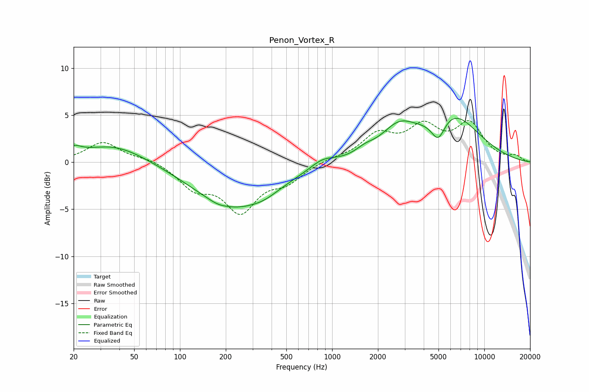

# Penon_Vortex_R
See [usage instructions](https://github.com/jaakkopasanen/AutoEq#usage) for more options and info.

### Parametric EQs
Apply preamp of -4.8 dB when using parametric equalizer.

|   # | Type    |   Fc (Hz) |    Q |   Gain (dB) |
|-----|---------|-----------|------|-------------|
|   1 | Peaking |        20 | 2.94 |         0.8 |
|   2 | Peaking |        37 | 0.68 |         1.9 |
|   3 | Peaking |       176 | 2.65 |        -0.2 |
|   4 | Peaking |       228 | 0.53 |        -4.7 |
|   5 | Peaking |       359 | 1.64 |        -0.4 |
|   6 | Peaking |       864 | 1.71 |         0.9 |
|   7 | Peaking |      1642 | 2.32 |         0.6 |
|   8 | Peaking |      2722 | 1.24 |         2.8 |
|   9 | Peaking |      4982 | 2.95 |        -2.6 |
|  10 | Peaking |      6046 | 0.75 |         5   |

### Fixed Band EQs
When using fixed band (also called graphic) equalizer, apply preamp of **-4.5 dB** (if available) and set gains manually with these parameters.

|   # | Type    |   Fc (Hz) |    Q |   Gain (dB) |
|-----|---------|-----------|------|-------------|
|   1 | Peaking |        31 | 1.41 |         2.1 |
|   2 | Peaking |        62 | 1.41 |         0.4 |
|   3 | Peaking |       125 | 1.41 |        -2.5 |
|   4 | Peaking |       250 | 1.41 |        -4.9 |
|   5 | Peaking |       500 | 1.41 |        -1.8 |
|   6 | Peaking |      1000 | 1.41 |         0.3 |
|   7 | Peaking |      2000 | 1.41 |         2.7 |
|   8 | Peaking |      4000 | 1.41 |         3.3 |
|   9 | Peaking |      8000 | 1.41 |         3.8 |
|  10 | Peaking |     16000 | 1.41 |         0.6 |

### Graphs

