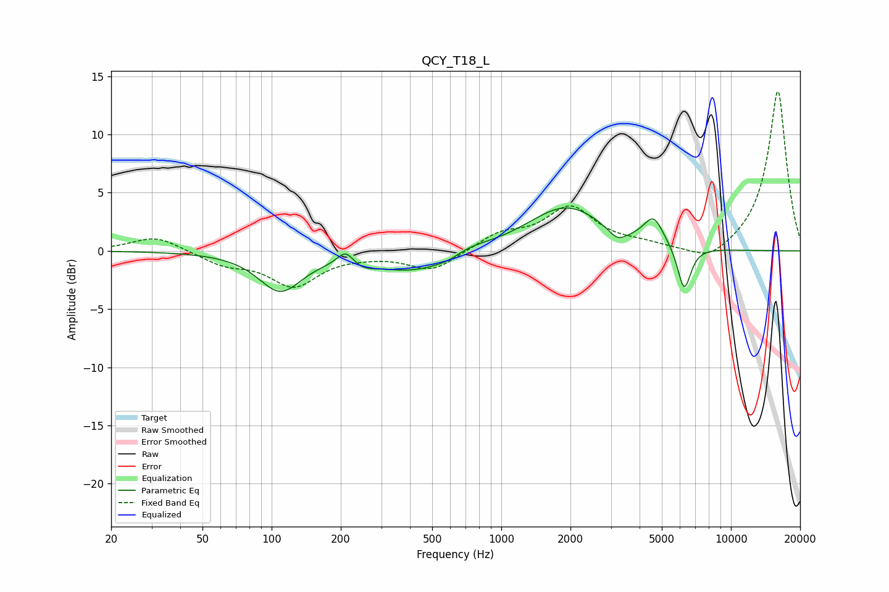

# QCY_T18_L
See [usage instructions](https://github.com/jaakkopasanen/AutoEq#usage) for more options and info.

### Parametric EQs
Apply preamp of -3.8 dB when using parametric equalizer.

|   # | Type    |   Fc (Hz) |    Q |   Gain (dB) |
|-----|---------|-----------|------|-------------|
|   1 | Peaking |       109 | 1.51 |        -3.3 |
|   2 | Peaking |       210 | 4.05 |         1.2 |
|   3 | Peaking |       250 | 2.86 |        -0.5 |
|   4 | Peaking |       414 | 0.84 |        -1.8 |
|   5 | Peaking |       595 | 2.23 |        -0.4 |
|   6 | Peaking |       703 | 1.61 |         0.6 |
|   7 | Peaking |      1916 | 0.85 |         3.8 |
|   8 | Peaking |      3205 | 3.23 |        -1.1 |
|   9 | Peaking |      4605 | 3.21 |         2.3 |
|  10 | Peaking |      6256 | 4.7  |        -3.9 |

### Fixed Band EQs
When using fixed band (also called graphic) equalizer, apply preamp of **-13.8 dB** (if available) and set gains manually with these parameters.

|   # | Type    |   Fc (Hz) |    Q |   Gain (dB) |
|-----|---------|-----------|------|-------------|
|   1 | Peaking |        31 | 1.41 |         1.3 |
|   2 | Peaking |        62 | 1.41 |        -1.1 |
|   3 | Peaking |       125 | 1.41 |        -2.9 |
|   4 | Peaking |       250 | 1.41 |        -0.2 |
|   5 | Peaking |       500 | 1.41 |        -1.7 |
|   6 | Peaking |      1000 | 1.41 |         1.4 |
|   7 | Peaking |      2000 | 1.41 |         3.6 |
|   8 | Peaking |      4000 | 1.41 |         0.4 |
|   9 | Peaking |      8000 | 1.41 |        -1.2 |
|  10 | Peaking |     16000 | 1.41 |        13.9 |

### Graphs

