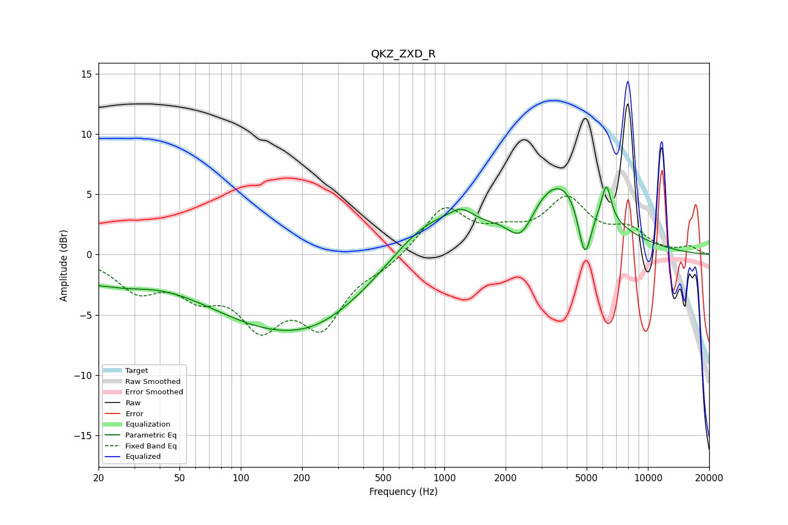

# QKZ_ZXD_R
See [usage instructions](https://github.com/jaakkopasanen/AutoEq#usage) for more options and info.

### Parametric EQs
Apply preamp of -5.7 dB when using parametric equalizer.

|   # | Type    |   Fc (Hz) |    Q |   Gain (dB) |
|-----|---------|-----------|------|-------------|
|   1 | Peaking |        20 | 4    |        -0.4 |
|   2 | Peaking |        25 | 0.94 |        -1.6 |
|   3 | Peaking |       172 | 0.34 |        -6.2 |
|   4 | Peaking |       239 | 0.9  |        -0.4 |
|   5 | Peaking |       816 | 0.75 |         3.5 |
|   6 | Peaking |      1211 | 2.37 |         1.2 |
|   7 | Peaking |      2385 | 2.16 |        -2.8 |
|   8 | Peaking |      3706 | 0.74 |         6.4 |
|   9 | Peaking |      4898 | 4.13 |        -5.1 |
|  10 | Peaking |      6248 | 5.93 |         2.9 |

### Fixed Band EQs
When using fixed band (also called graphic) equalizer, apply preamp of **-4.9 dB** (if available) and set gains manually with these parameters.

|   # | Type    |   Fc (Hz) |    Q |   Gain (dB) |
|-----|---------|-----------|------|-------------|
|   1 | Peaking |        31 | 1.41 |        -2.7 |
|   2 | Peaking |        62 | 1.41 |        -2.6 |
|   3 | Peaking |       125 | 1.41 |        -5.1 |
|   4 | Peaking |       250 | 1.41 |        -5.3 |
|   5 | Peaking |       500 | 1.41 |        -0.9 |
|   6 | Peaking |      1000 | 1.41 |         3.9 |
|   7 | Peaking |      2000 | 1.41 |         1.3 |
|   8 | Peaking |      4000 | 1.41 |         4.2 |
|   9 | Peaking |      8000 | 1.41 |         1.8 |
|  10 | Peaking |     16000 | 1.41 |         0.6 |

### Graphs

