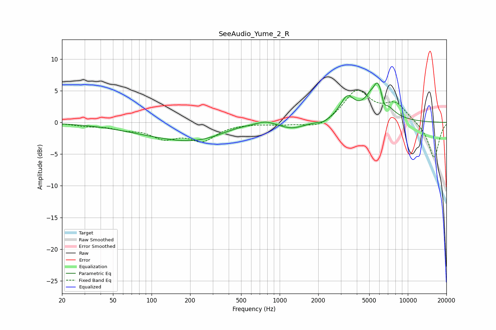

# SeeAudio_Yume_2_R
See [usage instructions](https://github.com/jaakkopasanen/AutoEq#usage) for more options and info.

### Parametric EQs
Apply preamp of -6.3 dB when using parametric equalizer.

|   # | Type    |   Fc (Hz) |    Q |   Gain (dB) |
|-----|---------|-----------|------|-------------|
|   1 | Peaking |        92 | 0.48 |        -0.9 |
|   2 | Peaking |       240 | 0.5  |        -2.7 |
|   3 | Peaking |       456 | 0.8  |         0.9 |
|   4 | Peaking |       780 | 1.88 |         0.7 |
|   5 | Peaking |      1251 | 1.43 |        -0.9 |
|   6 | Peaking |      2199 | 4.1  |        -0.4 |
|   7 | Peaking |      3365 | 2.53 |         3.4 |
|   8 | Peaking |      5428 | 5.73 |        -1   |
|   9 | Peaking |      5731 | 2.19 |         7.1 |
|  10 | Peaking |      6504 | 6    |        -2   |

### Fixed Band EQs
When using fixed band (also called graphic) equalizer, apply preamp of **-5.2 dB** (if available) and set gains manually with these parameters.

|   # | Type    |   Fc (Hz) |    Q |   Gain (dB) |
|-----|---------|-----------|------|-------------|
|   1 | Peaking |        31 | 1.41 |        -0.4 |
|   2 | Peaking |        62 | 1.41 |        -0.8 |
|   3 | Peaking |       125 | 1.41 |        -2.2 |
|   4 | Peaking |       250 | 1.41 |        -2.6 |
|   5 | Peaking |       500 | 1.41 |        -0.1 |
|   6 | Peaking |      1000 | 1.41 |        -0.3 |
|   7 | Peaking |      2000 | 1.41 |        -1.1 |
|   8 | Peaking |      4000 | 1.41 |         4.9 |
|   9 | Peaking |      8000 | 1.41 |         2.8 |
|  10 | Peaking |     16000 | 1.41 |        -5.7 |

### Graphs

