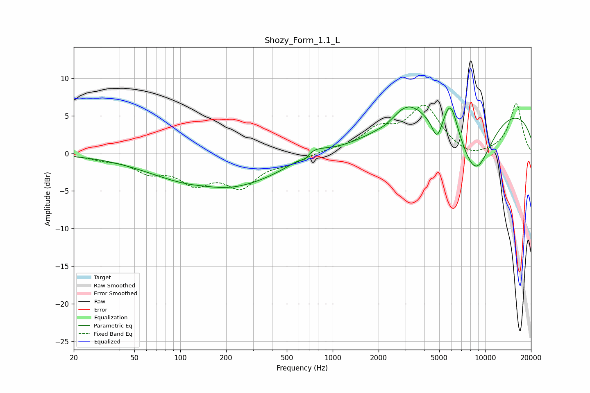

# Shozy_Form_1.1_L
See [usage instructions](https://github.com/jaakkopasanen/AutoEq#usage) for more options and info.

### Parametric EQs
Apply preamp of -6.3 dB when using parametric equalizer.

|   # | Type    |   Fc (Hz) |    Q |   Gain (dB) |
|-----|---------|-----------|------|-------------|
|   1 | Peaking |       146 | 1.35 |         0.4 |
|   2 | Peaking |       177 | 0.37 |        -4.9 |
|   3 | Peaking |       656 | 5.72 |        -0.7 |
|   4 | Peaking |       734 | 1.55 |         1.4 |
|   5 | Peaking |      2232 | 3.29 |        -0.3 |
|   6 | Peaking |      3093 | 1.42 |         2.8 |
|   7 | Peaking |      4843 | 4.05 |        -3   |
|   8 | Peaking |      5927 | 3.02 |         4.5 |
|   9 | Peaking |      8620 | 1.09 |        -8.9 |
|  10 | Peaking |     10000 | 0.19 |         6.7 |

### Fixed Band EQs
When using fixed band (also called graphic) equalizer, apply preamp of **-6.7 dB** (if available) and set gains manually with these parameters.

|   # | Type    |   Fc (Hz) |    Q |   Gain (dB) |
|-----|---------|-----------|------|-------------|
|   1 | Peaking |        31 | 1.41 |        -0.6 |
|   2 | Peaking |        62 | 1.41 |        -2.1 |
|   3 | Peaking |       125 | 1.41 |        -3.4 |
|   4 | Peaking |       250 | 1.41 |        -4   |
|   5 | Peaking |       500 | 1.41 |        -1   |
|   6 | Peaking |      1000 | 1.41 |         0.4 |
|   7 | Peaking |      2000 | 1.41 |         2.8 |
|   8 | Peaking |      4000 | 1.41 |         6   |
|   9 | Peaking |      8000 | 1.41 |        -0.9 |
|  10 | Peaking |     16000 | 1.41 |         6.6 |

### Graphs

