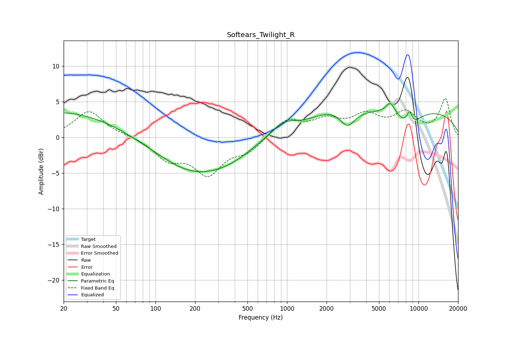

# Softears_Twilight_R
See [usage instructions](https://github.com/jaakkopasanen/AutoEq#usage) for more options and info.

### Parametric EQs
Apply preamp of -4.8 dB when using parametric equalizer.

|   # | Type    |   Fc (Hz) |    Q |   Gain (dB) |
|-----|---------|-----------|------|-------------|
|   1 | Peaking |        20 | 0.34 |         3.6 |
|   2 | Peaking |       192 | 0.52 |        -4.6 |
|   3 | Peaking |       369 | 0.83 |        -1.2 |
|   4 | Peaking |       934 | 1.38 |         1.9 |
|   5 | Peaking |      2137 | 0.91 |         1.5 |
|   6 | Peaking |      2884 | 2.57 |        -2.3 |
|   7 | Peaking |      6125 | 4.06 |         1.6 |
|   8 | Peaking |      8465 | 0.2  |         3.9 |
|   9 | Peaking |      8510 | 1.65 |        -2.5 |
|  10 | Peaking |      8535 | 5.94 |         2   |

### Fixed Band EQs
When using fixed band (also called graphic) equalizer, apply preamp of **-5.5 dB** (if available) and set gains manually with these parameters.

|   # | Type    |   Fc (Hz) |    Q |   Gain (dB) |
|-----|---------|-----------|------|-------------|
|   1 | Peaking |        31 | 1.41 |         3.7 |
|   2 | Peaking |        62 | 1.41 |         0.2 |
|   3 | Peaking |       125 | 1.41 |        -2.8 |
|   4 | Peaking |       250 | 1.41 |        -4.8 |
|   5 | Peaking |       500 | 1.41 |        -1.8 |
|   6 | Peaking |      1000 | 1.41 |         2.4 |
|   7 | Peaking |      2000 | 1.41 |         2.1 |
|   8 | Peaking |      4000 | 1.41 |         2.7 |
|   9 | Peaking |      8000 | 1.41 |         3.1 |
|  10 | Peaking |     16000 | 1.41 |         5.3 |

### Graphs

