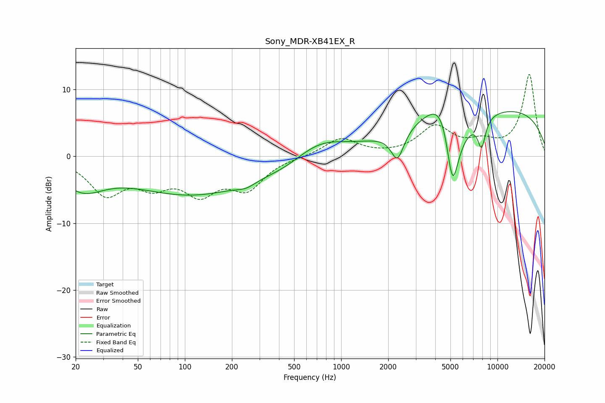

# Sony_MDR-XB41EX_R
See [usage instructions](https://github.com/jaakkopasanen/AutoEq#usage) for more options and info.

### Parametric EQs
Apply preamp of -6.8 dB when using parametric equalizer.

|   # | Type    |   Fc (Hz) |    Q |   Gain (dB) |
|-----|---------|-----------|------|-------------|
|   1 | Peaking |        22 | 1.01 |        -4   |
|   2 | Peaking |       113 | 0.35 |        -5.6 |
|   3 | Peaking |       246 | 2.38 |        -0.8 |
|   4 | Peaking |       451 | 0.89 |        -1.2 |
|   5 | Peaking |       709 | 0.81 |         2.9 |
|   6 | Peaking |      2292 | 3.4  |        -4.4 |
|   7 | Peaking |      4594 | 1.2  |        12.5 |
|   8 | Peaking |      5149 | 1.91 |       -20   |
|   9 | Peaking |      7917 | 5.3  |        -4.2 |
|  10 | Peaking |     10000 | 0.22 |         7.2 |

### Fixed Band EQs
When using fixed band (also called graphic) equalizer, apply preamp of **-12.4 dB** (if available) and set gains manually with these parameters.

|   # | Type    |   Fc (Hz) |    Q |   Gain (dB) |
|-----|---------|-----------|------|-------------|
|   1 | Peaking |        31 | 1.41 |        -5.3 |
|   2 | Peaking |        62 | 1.41 |        -3.5 |
|   3 | Peaking |       125 | 1.41 |        -4.8 |
|   4 | Peaking |       250 | 1.41 |        -4.4 |
|   5 | Peaking |       500 | 1.41 |        -0.1 |
|   6 | Peaking |      1000 | 1.41 |         2.7 |
|   7 | Peaking |      2000 | 1.41 |         0   |
|   8 | Peaking |      4000 | 1.41 |         4.2 |
|   9 | Peaking |      8000 | 1.41 |         1.7 |
|  10 | Peaking |     16000 | 1.41 |        12.2 |

### Graphs

