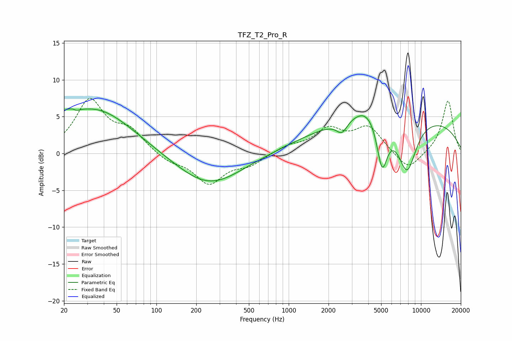

# TFZ_T2_Pro_R
See [usage instructions](https://github.com/jaakkopasanen/AutoEq#usage) for more options and info.

### Parametric EQs
Apply preamp of -6.2 dB when using parametric equalizer.

|   # | Type    |   Fc (Hz) |    Q |   Gain (dB) |
|-----|---------|-----------|------|-------------|
|   1 | Peaking |        20 | 1.91 |         1.6 |
|   2 | Peaking |        24 | 5.78 |         1.6 |
|   3 | Peaking |        24 | 5.78 |        -1.8 |
|   4 | Peaking |        35 | 0.51 |         6   |
|   5 | Peaking |       250 | 0.58 |        -4.4 |
|   6 | Peaking |      2526 | 3.48 |        -1.6 |
|   7 | Peaking |      3985 | 1.33 |         2.2 |
|   8 | Peaking |      5079 | 3.36 |        -6.8 |
|   9 | Peaking |      6784 | 0.18 |         5.2 |
|  10 | Peaking |      7838 | 1.83 |        -7.2 |

### Fixed Band EQs
When using fixed band (also called graphic) equalizer, apply preamp of **-7.6 dB** (if available) and set gains manually with these parameters.

|   # | Type    |   Fc (Hz) |    Q |   Gain (dB) |
|-----|---------|-----------|------|-------------|
|   1 | Peaking |        31 | 1.41 |         7   |
|   2 | Peaking |        62 | 1.41 |         2.7 |
|   3 | Peaking |       125 | 1.41 |        -1.1 |
|   4 | Peaking |       250 | 1.41 |        -4   |
|   5 | Peaking |       500 | 1.41 |        -1.4 |
|   6 | Peaking |      1000 | 1.41 |         0.9 |
|   7 | Peaking |      2000 | 1.41 |         3   |
|   8 | Peaking |      4000 | 1.41 |         3.5 |
|   9 | Peaking |      8000 | 1.41 |        -2.5 |
|  10 | Peaking |     16000 | 1.41 |         7.2 |

### Graphs

