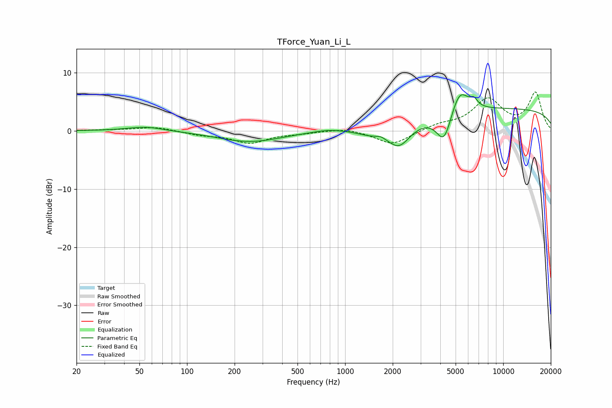

# TForce_Yuan_Li_L
See [usage instructions](https://github.com/jaakkopasanen/AutoEq#usage) for more options and info.

### Parametric EQs
Apply preamp of -6.3 dB when using parametric equalizer.

|   # | Type    |   Fc (Hz) |    Q |   Gain (dB) |
|-----|---------|-----------|------|-------------|
|   1 | Peaking |        55 | 1.24 |         0.8 |
|   2 | Peaking |       249 | 0.71 |        -1.9 |
|   3 | Peaking |       772 | 1.65 |         0.4 |
|   4 | Peaking |      1417 | 1.59 |        -0.9 |
|   5 | Peaking |      1681 | 5.97 |         0.3 |
|   6 | Peaking |      2191 | 1.9  |        -4   |
|   7 | Peaking |      4228 | 2.88 |        -5.3 |
|   8 | Peaking |      5288 | 2.51 |         4.4 |
|   9 | Peaking |      6534 | 5.98 |         1.2 |
|  10 | Peaking |     10000 | 0.18 |         3.8 |

### Fixed Band EQs
When using fixed band (also called graphic) equalizer, apply preamp of **-6.8 dB** (if available) and set gains manually with these parameters.

|   # | Type    |   Fc (Hz) |    Q |   Gain (dB) |
|-----|---------|-----------|------|-------------|
|   1 | Peaking |        31 | 1.41 |         0.1 |
|   2 | Peaking |        62 | 1.41 |         0.7 |
|   3 | Peaking |       125 | 1.41 |        -0.6 |
|   4 | Peaking |       250 | 1.41 |        -2   |
|   5 | Peaking |       500 | 1.41 |        -0.3 |
|   6 | Peaking |      1000 | 1.41 |         0.5 |
|   7 | Peaking |      2000 | 1.41 |        -2.4 |
|   8 | Peaking |      4000 | 1.41 |         0.9 |
|   9 | Peaking |      8000 | 1.41 |         5.3 |
|  10 | Peaking |     16000 | 1.41 |         6.4 |

### Graphs

