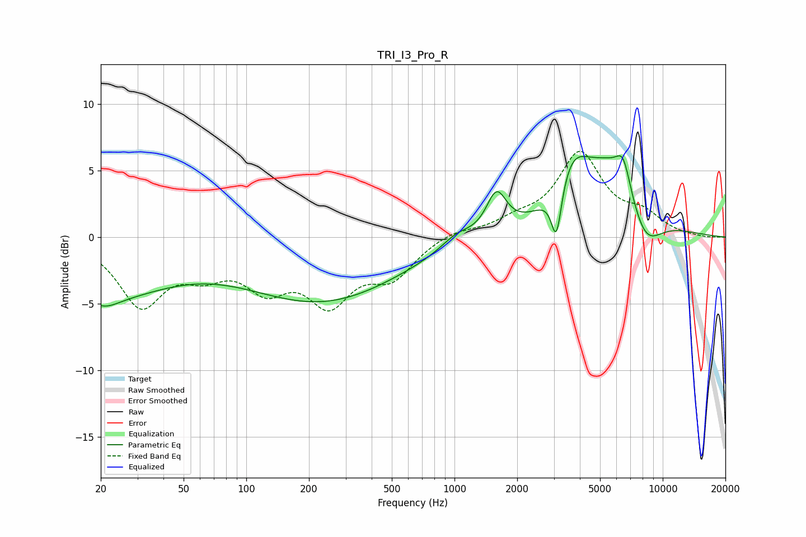

# TRI_I3_Pro_R
See [usage instructions](https://github.com/jaakkopasanen/AutoEq#usage) for more options and info.

### Parametric EQs
Apply preamp of -6.2 dB when using parametric equalizer.

|   # | Type    |   Fc (Hz) |    Q |   Gain (dB) |
|-----|---------|-----------|------|-------------|
|   1 | Peaking |        20 | 0.43 |        -4.1 |
|   2 | Peaking |        21 | 2.08 |        -0.8 |
|   3 | Peaking |       231 | 0.38 |        -4.7 |
|   4 | Peaking |      1022 | 1.9  |         1   |
|   5 | Peaking |      1590 | 2.92 |         3.1 |
|   6 | Peaking |      3087 | 5.7  |        -4   |
|   7 | Peaking |      3659 | 1.82 |         3.2 |
|   8 | Peaking |      5772 | 0.83 |         5.8 |
|   9 | Peaking |      6465 | 3.98 |         2.1 |
|  10 | Peaking |      8133 | 1.51 |        -3.8 |

### Fixed Band EQs
When using fixed band (also called graphic) equalizer, apply preamp of **-6.6 dB** (if available) and set gains manually with these parameters.

|   # | Type    |   Fc (Hz) |    Q |   Gain (dB) |
|-----|---------|-----------|------|-------------|
|   1 | Peaking |        31 | 1.41 |        -4.9 |
|   2 | Peaking |        62 | 1.41 |        -2   |
|   3 | Peaking |       125 | 1.41 |        -3.2 |
|   4 | Peaking |       250 | 1.41 |        -4.4 |
|   5 | Peaking |       500 | 1.41 |        -2.7 |
|   6 | Peaking |      1000 | 1.41 |         0.6 |
|   7 | Peaking |      2000 | 1.41 |         1   |
|   8 | Peaking |      4000 | 1.41 |         6.1 |
|   9 | Peaking |      8000 | 1.41 |         1.4 |
|  10 | Peaking |     16000 | 1.41 |        -0.1 |

### Graphs

