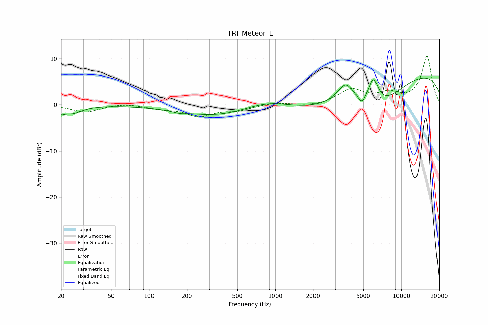

# TRI_Meteor_L
See [usage instructions](https://github.com/jaakkopasanen/AutoEq#usage) for more options and info.

### Parametric EQs
Apply preamp of -5.9 dB when using parametric equalizer.

|   # | Type    |   Fc (Hz) |    Q |   Gain (dB) |
|-----|---------|-----------|------|-------------|
|   1 | Peaking |        20 | 5.99 |        -0.9 |
|   2 | Peaking |        24 | 1.76 |        -1.8 |
|   3 | Peaking |       175 | 3.24 |        -0.4 |
|   4 | Peaking |       864 | 0.58 |         5.2 |
|   5 | Peaking |      1059 | 0.22 |        -6   |
|   6 | Peaking |      3619 | 2.2  |         4   |
|   7 | Peaking |      4845 | 4.91 |        -1.8 |
|   8 | Peaking |      6020 | 3.64 |         5.3 |
|   9 | Peaking |      6856 | 0.72 |        -5.5 |
|  10 | Peaking |     10000 | 0.18 |         7.5 |

### Fixed Band EQs
When using fixed band (also called graphic) equalizer, apply preamp of **-10.7 dB** (if available) and set gains manually with these parameters.

|   # | Type    |   Fc (Hz) |    Q |   Gain (dB) |
|-----|---------|-----------|------|-------------|
|   1 | Peaking |        31 | 1.41 |        -1.6 |
|   2 | Peaking |        62 | 1.41 |         0.4 |
|   3 | Peaking |       125 | 1.41 |        -0.7 |
|   4 | Peaking |       250 | 1.41 |        -2.3 |
|   5 | Peaking |       500 | 1.41 |        -1.1 |
|   6 | Peaking |      1000 | 1.41 |         0.5 |
|   7 | Peaking |      2000 | 1.41 |        -0.4 |
|   8 | Peaking |      4000 | 1.41 |         3.1 |
|   9 | Peaking |      8000 | 1.41 |         2.1 |
|  10 | Peaking |     16000 | 1.41 |        10.5 |

### Graphs

