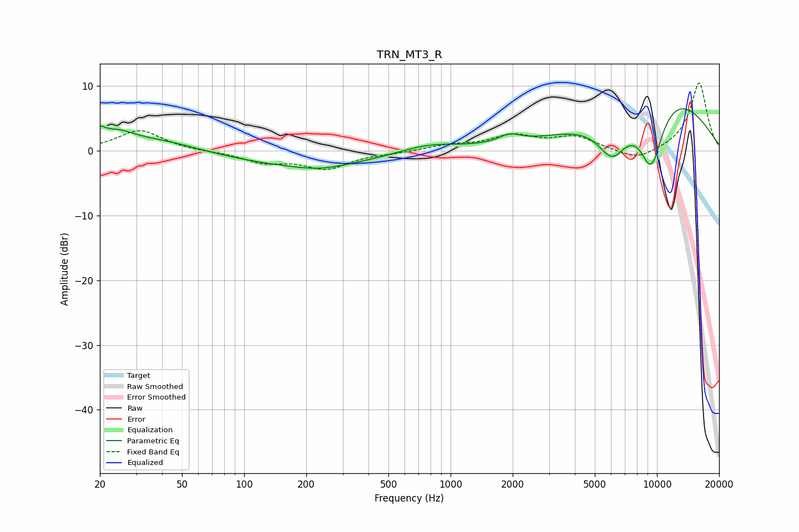

# TRN_MT3_R
See [usage instructions](https://github.com/jaakkopasanen/AutoEq#usage) for more options and info.

### Parametric EQs
Apply preamp of -6.6 dB when using parametric equalizer.

|   # | Type    |   Fc (Hz) |    Q |   Gain (dB) |
|-----|---------|-----------|------|-------------|
|   1 | Peaking |        20 | 5.83 |         1.5 |
|   2 | Peaking |        24 | 1.59 |         2.4 |
|   3 | Peaking |        40 | 0.78 |         1.5 |
|   4 | Peaking |       203 | 0.41 |        -2.4 |
|   5 | Peaking |       235 | 1.39 |        -0.5 |
|   6 | Peaking |       777 | 0.95 |         1.3 |
|   7 | Peaking |      1936 | 2.63 |         1.3 |
|   8 | Peaking |      6078 | 1.82 |        -6.3 |
|   9 | Peaking |      9375 | 1.87 |       -11.8 |
|  10 | Peaking |     10000 | 0.44 |        11.1 |

### Fixed Band EQs
When using fixed band (also called graphic) equalizer, apply preamp of **-10.6 dB** (if available) and set gains manually with these parameters.

|   # | Type    |   Fc (Hz) |    Q |   Gain (dB) |
|-----|---------|-----------|------|-------------|
|   1 | Peaking |        31 | 1.41 |         3.2 |
|   2 | Peaking |        62 | 1.41 |        -0.1 |
|   3 | Peaking |       125 | 1.41 |        -1.6 |
|   4 | Peaking |       250 | 1.41 |        -2.6 |
|   5 | Peaking |       500 | 1.41 |        -0.3 |
|   6 | Peaking |      1000 | 1.41 |         0.8 |
|   7 | Peaking |      2000 | 1.41 |         2.2 |
|   8 | Peaking |      4000 | 1.41 |         2   |
|   9 | Peaking |      8000 | 1.41 |        -1.7 |
|  10 | Peaking |     16000 | 1.41 |        10.6 |

### Graphs

