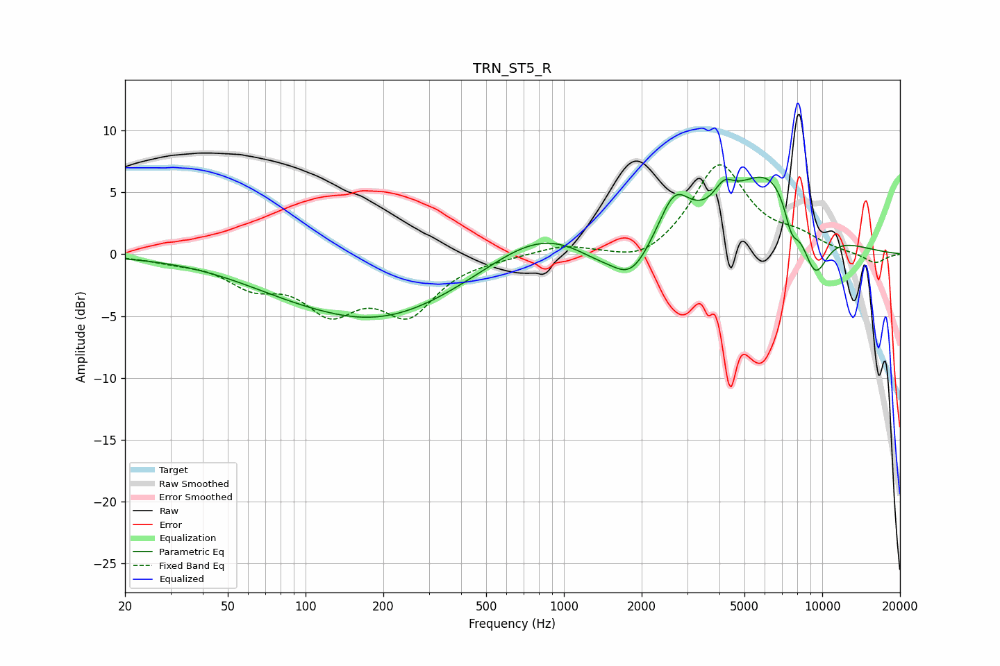

# TRN_ST5_R
See [usage instructions](https://github.com/jaakkopasanen/AutoEq#usage) for more options and info.

### Parametric EQs
Apply preamp of -6.3 dB when using parametric equalizer.

|   # | Type    |   Fc (Hz) |    Q |   Gain (dB) |
|-----|---------|-----------|------|-------------|
|   1 | Peaking |        77 | 0.68 |        -0.7 |
|   2 | Peaking |       192 | 0.43 |        -5.1 |
|   3 | Peaking |       795 | 0.75 |         2.4 |
|   4 | Peaking |      1320 | 1.66 |        -0.8 |
|   5 | Peaking |      1819 | 1.84 |        -2.9 |
|   6 | Peaking |      2675 | 2.31 |         3.7 |
|   7 | Peaking |      4168 | 3.68 |         1.6 |
|   8 | Peaking |      6315 | 0.85 |         6.9 |
|   9 | Peaking |      7603 | 4.58 |        -2.4 |
|  10 | Peaking |      9332 | 2.28 |        -4.9 |

### Fixed Band EQs
When using fixed band (also called graphic) equalizer, apply preamp of **-7.3 dB** (if available) and set gains manually with these parameters.

|   # | Type    |   Fc (Hz) |    Q |   Gain (dB) |
|-----|---------|-----------|------|-------------|
|   1 | Peaking |        31 | 1.41 |        -0.4 |
|   2 | Peaking |        62 | 1.41 |        -2.1 |
|   3 | Peaking |       125 | 1.41 |        -4   |
|   4 | Peaking |       250 | 1.41 |        -4.4 |
|   5 | Peaking |       500 | 1.41 |        -0.2 |
|   6 | Peaking |      1000 | 1.41 |         0.7 |
|   7 | Peaking |      2000 | 1.41 |        -1   |
|   8 | Peaking |      4000 | 1.41 |         7.2 |
|   9 | Peaking |      8000 | 1.41 |         1.1 |
|  10 | Peaking |     16000 | 1.41 |        -0.8 |

### Graphs

