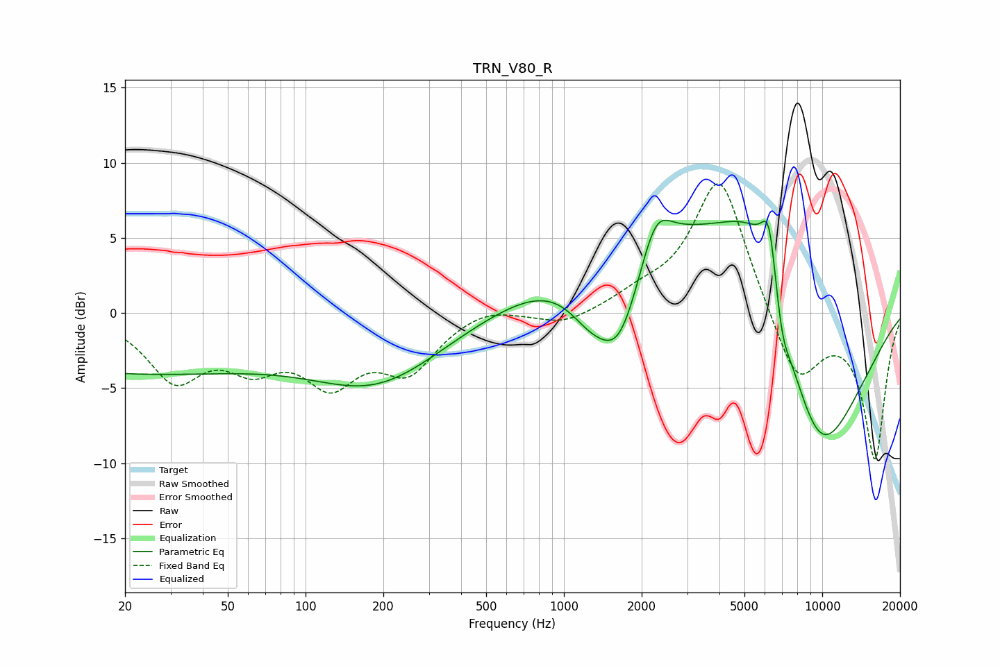

# TRN_V80_R
See [usage instructions](https://github.com/jaakkopasanen/AutoEq#usage) for more options and info.

### Parametric EQs
Apply preamp of -6.3 dB when using parametric equalizer.

|   # | Type    |   Fc (Hz) |    Q |   Gain (dB) |
|-----|---------|-----------|------|-------------|
|   1 | Peaking |        20 | 0.23 |        -3.9 |
|   2 | Peaking |       190 | 0.54 |        -4.3 |
|   3 | Peaking |      1259 | 1.51 |        -2.6 |
|   4 | Peaking |      1639 | 1.54 |        -6.3 |
|   5 | Peaking |      2268 | 2.44 |         2.9 |
|   6 | Peaking |      2388 | 0.36 |         6.6 |
|   7 | Peaking |      5590 | 0.98 |         6.8 |
|   8 | Peaking |      6234 | 4.56 |         4.2 |
|   9 | Peaking |      6969 | 4.2  |        -2.4 |
|  10 | Peaking |      9484 | 0.67 |       -11.9 |

### Fixed Band EQs
When using fixed band (also called graphic) equalizer, apply preamp of **-8.7 dB** (if available) and set gains manually with these parameters.

|   # | Type    |   Fc (Hz) |    Q |   Gain (dB) |
|-----|---------|-----------|------|-------------|
|   1 | Peaking |        31 | 1.41 |        -4.1 |
|   2 | Peaking |        62 | 1.41 |        -2.8 |
|   3 | Peaking |       125 | 1.41 |        -4.1 |
|   4 | Peaking |       250 | 1.41 |        -3.5 |
|   5 | Peaking |       500 | 1.41 |         0.6 |
|   6 | Peaking |      1000 | 1.41 |        -0.9 |
|   7 | Peaking |      2000 | 1.41 |         0.9 |
|   8 | Peaking |      4000 | 1.41 |         9.3 |
|   9 | Peaking |      8000 | 1.41 |        -4.9 |
|  10 | Peaking |     16000 | 1.41 |        -9.6 |

### Graphs

