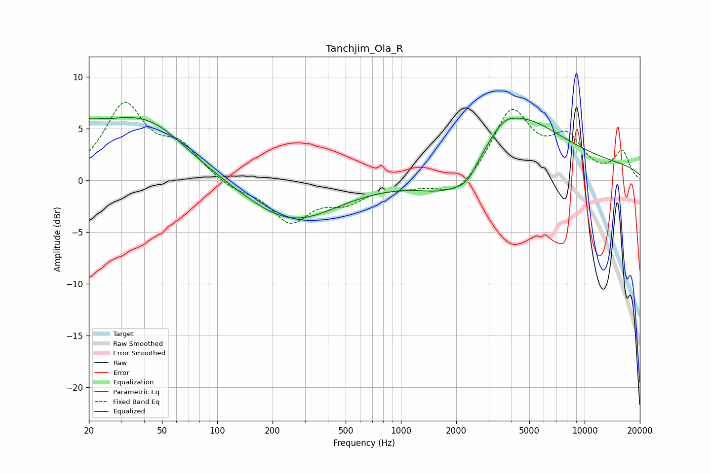

# Tanchjim_Ola_R
See [usage instructions](https://github.com/jaakkopasanen/AutoEq#usage) for more options and info.

### Parametric EQs
Apply preamp of -6.2 dB when using parametric equalizer.

|   # | Type    |   Fc (Hz) |    Q |   Gain (dB) |
|-----|---------|-----------|------|-------------|
|   1 | Peaking |        21 | 5.17 |         3.4 |
|   2 | Peaking |        21 | 6    |        -2.6 |
|   3 | Peaking |        28 | 0.45 |         5.2 |
|   4 | Peaking |        47 | 0.86 |         1.6 |
|   5 | Peaking |       254 | 0.58 |        -4   |
|   6 | Peaking |      1943 | 0.85 |        -3.3 |
|   7 | Peaking |      2297 | 2.81 |        -1   |
|   8 | Peaking |      3606 | 2.3  |         0.9 |
|   9 | Peaking |      4149 | 0.6  |         5.3 |
|  10 | Peaking |      9982 | 0.18 |         1.5 |

### Fixed Band EQs
When using fixed band (also called graphic) equalizer, apply preamp of **-7.6 dB** (if available) and set gains manually with these parameters.

|   # | Type    |   Fc (Hz) |    Q |   Gain (dB) |
|-----|---------|-----------|------|-------------|
|   1 | Peaking |        31 | 1.41 |         7.1 |
|   2 | Peaking |        62 | 1.41 |         2.9 |
|   3 | Peaking |       125 | 1.41 |        -0.8 |
|   4 | Peaking |       250 | 1.41 |        -3.8 |
|   5 | Peaking |       500 | 1.41 |        -1.8 |
|   6 | Peaking |      1000 | 1.41 |        -0.5 |
|   7 | Peaking |      2000 | 1.41 |        -1.8 |
|   8 | Peaking |      4000 | 1.41 |         6.6 |
|   9 | Peaking |      8000 | 1.41 |         3.6 |
|  10 | Peaking |     16000 | 1.41 |         2.7 |

### Graphs

