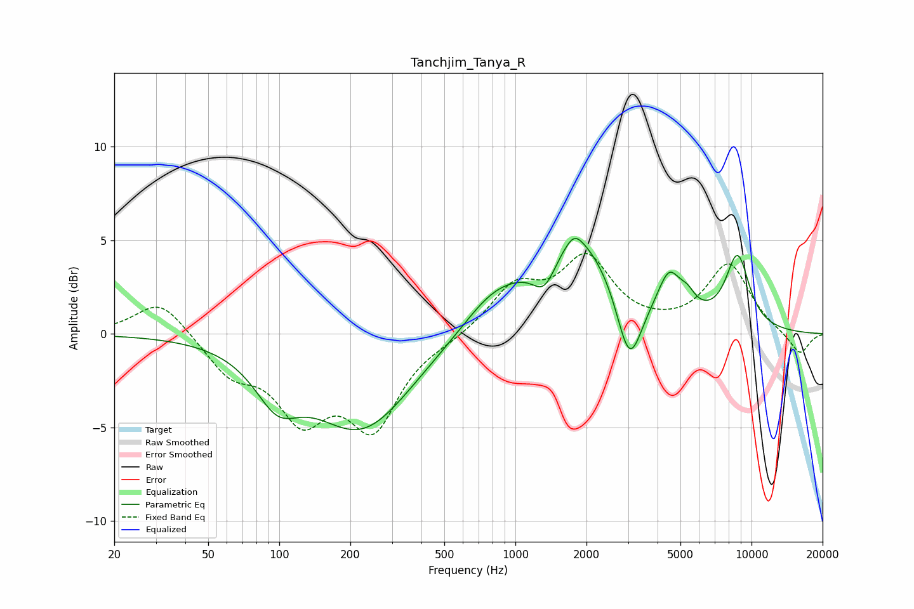

# Tanchjim_Tanya_R
See [usage instructions](https://github.com/jaakkopasanen/AutoEq#usage) for more options and info.

### Parametric EQs
Apply preamp of -5.2 dB when using parametric equalizer.

|   # | Type    |   Fc (Hz) |    Q |   Gain (dB) |
|-----|---------|-----------|------|-------------|
|   1 | Peaking |        98 | 1.52 |        -2.4 |
|   2 | Peaking |       223 | 0.67 |        -5   |
|   3 | Peaking |       794 | 1.11 |         1.4 |
|   4 | Peaking |      1331 | 2.67 |        -1.9 |
|   5 | Peaking |      1779 | 3.99 |         0.6 |
|   6 | Peaking |      1798 | 0.76 |         5.3 |
|   7 | Peaking |      3040 | 2.6  |        -4.2 |
|   8 | Peaking |      4480 | 2.92 |         2.2 |
|   9 | Peaking |      5350 | 4.08 |         0.7 |
|  10 | Peaking |      8726 | 2.53 |         3.8 |

### Fixed Band EQs
When using fixed band (also called graphic) equalizer, apply preamp of **-4.4 dB** (if available) and set gains manually with these parameters.

|   # | Type    |   Fc (Hz) |    Q |   Gain (dB) |
|-----|---------|-----------|------|-------------|
|   1 | Peaking |        31 | 1.41 |         1.9 |
|   2 | Peaking |        62 | 1.41 |        -1.9 |
|   3 | Peaking |       125 | 1.41 |        -4   |
|   4 | Peaking |       250 | 1.41 |        -4.6 |
|   5 | Peaking |       500 | 1.41 |        -0.2 |
|   6 | Peaking |      1000 | 1.41 |         2.4 |
|   7 | Peaking |      2000 | 1.41 |         3.8 |
|   8 | Peaking |      4000 | 1.41 |         0.1 |
|   9 | Peaking |      8000 | 1.41 |         3.7 |
|  10 | Peaking |     16000 | 1.41 |        -1.2 |

### Graphs

