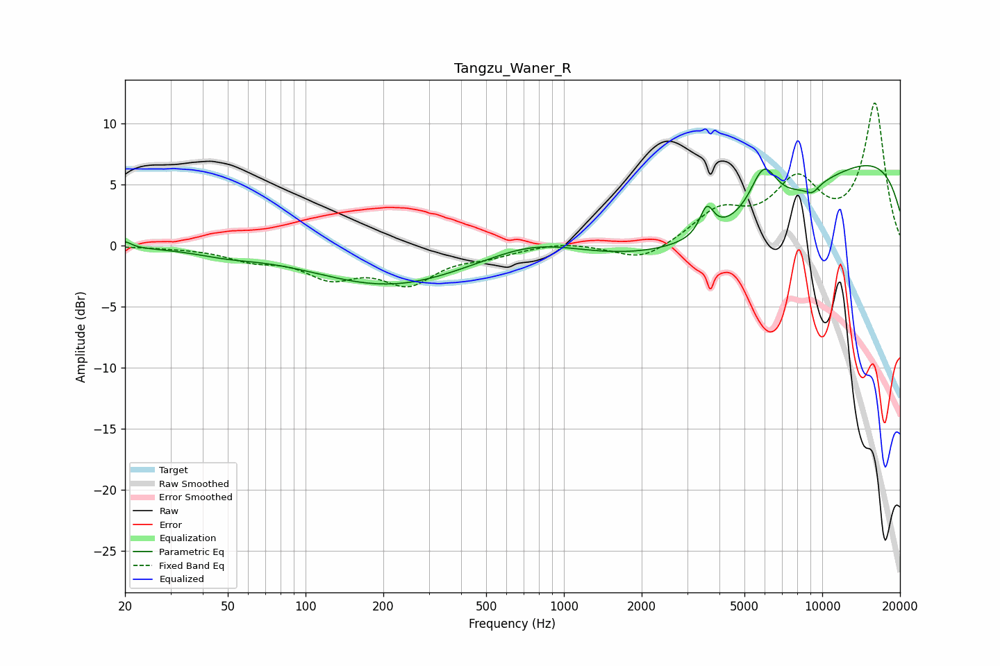

# Tangzu_Waner_R
See [usage instructions](https://github.com/jaakkopasanen/AutoEq#usage) for more options and info.

### Parametric EQs
Apply preamp of -6.7 dB when using parametric equalizer.

|   # | Type    |   Fc (Hz) |    Q |   Gain (dB) |
|-----|---------|-----------|------|-------------|
|   1 | Peaking |        20 | 6    |         0.5 |
|   2 | Peaking |        49 | 1.21 |        -0.4 |
|   3 | Peaking |       213 | 0.47 |        -3.2 |
|   4 | Peaking |       773 | 0.77 |         1.3 |
|   5 | Peaking |      3573 | 5.23 |         2.3 |
|   6 | Peaking |      4000 | 0.34 |        -6   |
|   7 | Peaking |      5928 | 2.64 |         3.7 |
|   8 | Peaking |      9156 | 4.56 |        -0.7 |
|   9 | Peaking |     10000 | 0.18 |         6   |
|  10 | Peaking |     10000 | 0.18 |         2.5 |

### Fixed Band EQs
When using fixed band (also called graphic) equalizer, apply preamp of **-11.8 dB** (if available) and set gains manually with these parameters.

|   # | Type    |   Fc (Hz) |    Q |   Gain (dB) |
|-----|---------|-----------|------|-------------|
|   1 | Peaking |        31 | 1.41 |        -0.1 |
|   2 | Peaking |        62 | 1.41 |        -1   |
|   3 | Peaking |       125 | 1.41 |        -2.2 |
|   4 | Peaking |       250 | 1.41 |        -2.8 |
|   5 | Peaking |       500 | 1.41 |        -0.7 |
|   6 | Peaking |      1000 | 1.41 |         0.4 |
|   7 | Peaking |      2000 | 1.41 |        -1.4 |
|   8 | Peaking |      4000 | 1.41 |         2.6 |
|   9 | Peaking |      8000 | 1.41 |         4.8 |
|  10 | Peaking |     16000 | 1.41 |        11.5 |

### Graphs

