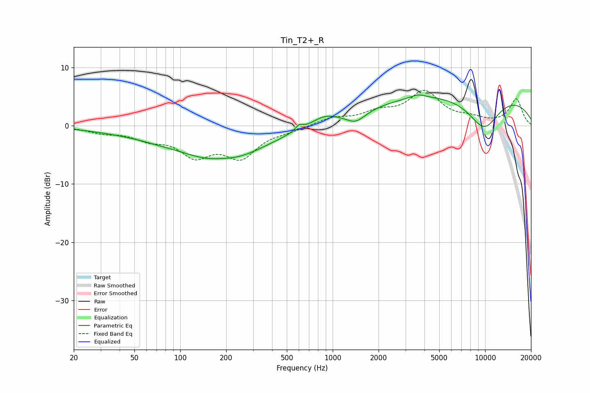

# Tin_T2+_R
See [usage instructions](https://github.com/jaakkopasanen/AutoEq#usage) for more options and info.

### Parametric EQs
Apply preamp of -5.4 dB when using parametric equalizer.

|   # | Type    |   Fc (Hz) |    Q |   Gain (dB) |
|-----|---------|-----------|------|-------------|
|   1 | Peaking |        52 | 0.51 |        -0.9 |
|   2 | Peaking |        72 | 1.62 |        -0.2 |
|   3 | Peaking |       188 | 1.68 |         0.5 |
|   4 | Peaking |       189 | 0.53 |        -6   |
|   5 | Peaking |       602 | 5.97 |         0.9 |
|   6 | Peaking |       882 | 1.8  |         1.3 |
|   7 | Peaking |      1421 | 2.25 |        -1.8 |
|   8 | Peaking |      3624 | 2.88 |         0.6 |
|   9 | Peaking |      7696 | 0.18 |         5.9 |
|  10 | Peaking |      9820 | 1.16 |        -5.9 |

### Fixed Band EQs
When using fixed band (also called graphic) equalizer, apply preamp of **-6.2 dB** (if available) and set gains manually with these parameters.

|   # | Type    |   Fc (Hz) |    Q |   Gain (dB) |
|-----|---------|-----------|------|-------------|
|   1 | Peaking |        31 | 1.41 |        -0.9 |
|   2 | Peaking |        62 | 1.41 |        -1.8 |
|   3 | Peaking |       125 | 1.41 |        -4.6 |
|   4 | Peaking |       250 | 1.41 |        -4.9 |
|   5 | Peaking |       500 | 1.41 |        -0.6 |
|   6 | Peaking |      1000 | 1.41 |         1.3 |
|   7 | Peaking |      2000 | 1.41 |         1.9 |
|   8 | Peaking |      4000 | 1.41 |         5.6 |
|   9 | Peaking |      8000 | 1.41 |         0.9 |
|  10 | Peaking |     16000 | 1.41 |         4.6 |

### Graphs

