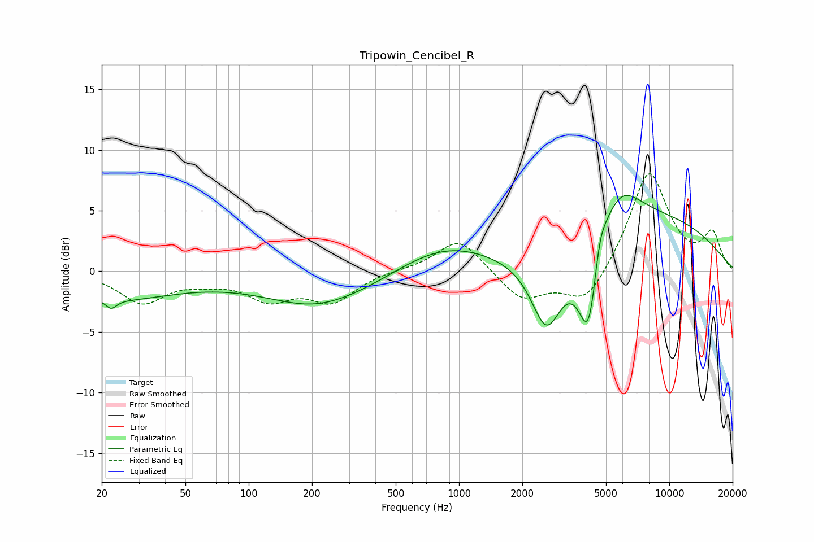

# Tripowin_Cencibel_R
See [usage instructions](https://github.com/jaakkopasanen/AutoEq#usage) for more options and info.

### Parametric EQs
Apply preamp of -6.4 dB when using parametric equalizer.

|   # | Type    |   Fc (Hz) |    Q |   Gain (dB) |
|-----|---------|-----------|------|-------------|
|   1 | Peaking |        22 | 5.79 |        -0.7 |
|   2 | Peaking |        22 | 0.46 |        -2.2 |
|   3 | Peaking |       199 | 0.95 |        -0.4 |
|   4 | Peaking |       233 | 0.47 |        -2.6 |
|   5 | Peaking |       841 | 0.59 |         2.4 |
|   6 | Peaking |      2609 | 1.93 |        -5.9 |
|   7 | Peaking |      4163 | 2.69 |        -9.1 |
|   8 | Peaking |      4644 | 4.43 |         2.8 |
|   9 | Peaking |      5627 | 1.27 |         4.5 |
|  10 | Peaking |      9070 | 0.38 |         4   |

### Fixed Band EQs
When using fixed band (also called graphic) equalizer, apply preamp of **-8.1 dB** (if available) and set gains manually with these parameters.

|   # | Type    |   Fc (Hz) |    Q |   Gain (dB) |
|-----|---------|-----------|------|-------------|
|   1 | Peaking |        31 | 1.41 |        -2.5 |
|   2 | Peaking |        62 | 1.41 |        -0.6 |
|   3 | Peaking |       125 | 1.41 |        -2.1 |
|   4 | Peaking |       250 | 1.41 |        -2.4 |
|   5 | Peaking |       500 | 1.41 |         0.1 |
|   6 | Peaking |      1000 | 1.41 |         2.8 |
|   7 | Peaking |      2000 | 1.41 |        -2.4 |
|   8 | Peaking |      4000 | 1.41 |        -2.9 |
|   9 | Peaking |      8000 | 1.41 |         8.3 |
|  10 | Peaking |     16000 | 1.41 |         3   |

### Graphs

