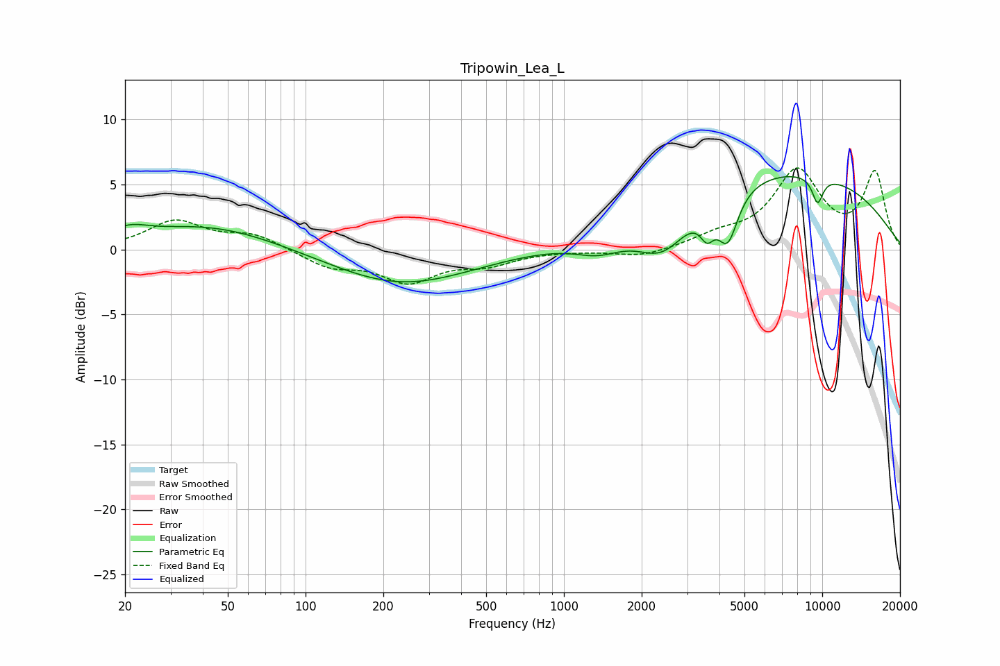

# Tripowin_Lea_L
See [usage instructions](https://github.com/jaakkopasanen/AutoEq#usage) for more options and info.

### Parametric EQs
Apply preamp of -5.7 dB when using parametric equalizer.

|   # | Type    |   Fc (Hz) |    Q |   Gain (dB) |
|-----|---------|-----------|------|-------------|
|   1 | Peaking |        21 | 2.04 |         0.8 |
|   2 | Peaking |        42 | 0.52 |         1.9 |
|   3 | Peaking |       234 | 0.52 |        -2.7 |
|   4 | Peaking |      1367 | 1.47 |        -1.3 |
|   5 | Peaking |      2414 | 1.38 |        -3.4 |
|   6 | Peaking |      3583 | 5.22 |        -1.8 |
|   7 | Peaking |      4310 | 3.51 |        -3.8 |
|   8 | Peaking |      6963 | 0.27 |         6.2 |
|   9 | Peaking |      9586 | 5.67 |         1.2 |
|  10 | Peaking |      9592 | 5.72 |        -3.2 |

### Fixed Band EQs
When using fixed band (also called graphic) equalizer, apply preamp of **-6.4 dB** (if available) and set gains manually with these parameters.

|   # | Type    |   Fc (Hz) |    Q |   Gain (dB) |
|-----|---------|-----------|------|-------------|
|   1 | Peaking |        31 | 1.41 |         2.1 |
|   2 | Peaking |        62 | 1.41 |         1.1 |
|   3 | Peaking |       125 | 1.41 |        -1.3 |
|   4 | Peaking |       250 | 1.41 |        -2.3 |
|   5 | Peaking |       500 | 1.41 |        -1   |
|   6 | Peaking |      1000 | 1.41 |        -0   |
|   7 | Peaking |      2000 | 1.41 |        -0.6 |
|   8 | Peaking |      4000 | 1.41 |         0.9 |
|   9 | Peaking |      8000 | 1.41 |         5.9 |
|  10 | Peaking |     16000 | 1.41 |         5.8 |

### Graphs

