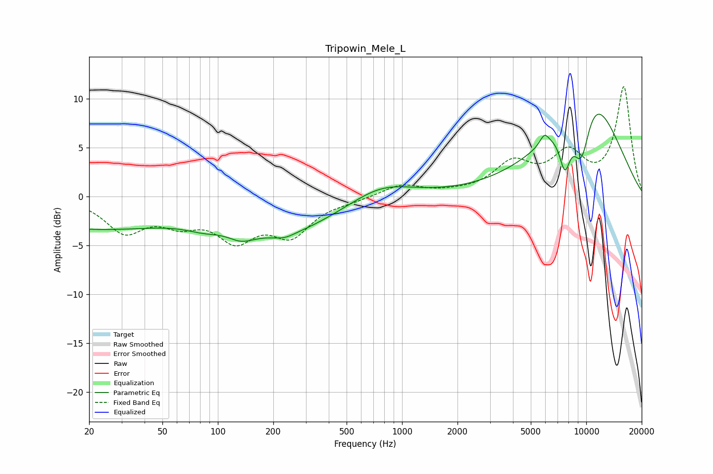

# Tripowin_Mele_L
See [usage instructions](https://github.com/jaakkopasanen/AutoEq#usage) for more options and info.

### Parametric EQs
Apply preamp of -8.5 dB when using parametric equalizer.

|   # | Type    |   Fc (Hz) |    Q |   Gain (dB) |
|-----|---------|-----------|------|-------------|
|   1 | Peaking |        20 | 0.29 |        -3.2 |
|   2 | Peaking |        83 | 1.42 |        -0.7 |
|   3 | Peaking |       133 | 2.05 |        -1   |
|   4 | Peaking |       230 | 0.5  |        -3.5 |
|   5 | Peaking |       230 | 2.71 |        -0.4 |
|   6 | Peaking |       773 | 0.84 |         1.7 |
|   7 | Peaking |      5927 | 5.76 |         1.1 |
|   8 | Peaking |      7653 | 4.23 |        -4.2 |
|   9 | Peaking |      9405 | 2.38 |        -7   |
|  10 | Peaking |     10000 | 0.63 |        11.9 |

### Fixed Band EQs
When using fixed band (also called graphic) equalizer, apply preamp of **-11.3 dB** (if available) and set gains manually with these parameters.

|   # | Type    |   Fc (Hz) |    Q |   Gain (dB) |
|-----|---------|-----------|------|-------------|
|   1 | Peaking |        31 | 1.41 |        -3.4 |
|   2 | Peaking |        62 | 1.41 |        -2.1 |
|   3 | Peaking |       125 | 1.41 |        -3.9 |
|   4 | Peaking |       250 | 1.41 |        -3.6 |
|   5 | Peaking |       500 | 1.41 |        -0.3 |
|   6 | Peaking |      1000 | 1.41 |         1.2 |
|   7 | Peaking |      2000 | 1.41 |         0.2 |
|   8 | Peaking |      4000 | 1.41 |         3.1 |
|   9 | Peaking |      8000 | 1.41 |         3.9 |
|  10 | Peaking |     16000 | 1.41 |        11.1 |

### Graphs

