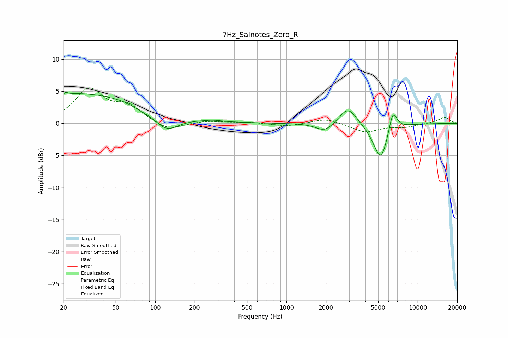

# 7Hz_Salnotes_Zero_R
See [usage instructions](https://github.com/jaakkopasanen/AutoEq#usage) for more options and info.

### Parametric EQs
Apply preamp of -4.9 dB when using parametric equalizer.

|   # | Type    |   Fc (Hz) |    Q |   Gain (dB) |
|-----|---------|-----------|------|-------------|
|   1 | Peaking |        20 | 5.38 |        -3.2 |
|   2 | Peaking |        20 | 5.96 |         3.2 |
|   3 | Peaking |        22 | 0.21 |         4.8 |
|   4 | Peaking |        77 | 2.21 |        -0.4 |
|   5 | Peaking |       121 | 1.48 |        -2.8 |
|   6 | Peaking |       279 | 2.49 |         0.2 |
|   7 | Peaking |      1965 | 2.09 |        -1.4 |
|   8 | Peaking |      2946 | 2.15 |         2.8 |
|   9 | Peaking |      5236 | 2.4  |        -5.9 |
|  10 | Peaking |      6461 | 4.24 |         3.6 |

### Fixed Band EQs
When using fixed band (also called graphic) equalizer, apply preamp of **-5.6 dB** (if available) and set gains manually with these parameters.

|   # | Type    |   Fc (Hz) |    Q |   Gain (dB) |
|-----|---------|-----------|------|-------------|
|   1 | Peaking |        31 | 1.41 |         5.1 |
|   2 | Peaking |        62 | 1.41 |         2.4 |
|   3 | Peaking |       125 | 1.41 |        -1.3 |
|   4 | Peaking |       250 | 1.41 |         0.4 |
|   5 | Peaking |       500 | 1.41 |         0.2 |
|   6 | Peaking |      1000 | 1.41 |        -0.5 |
|   7 | Peaking |      2000 | 1.41 |         0.8 |
|   8 | Peaking |      4000 | 1.41 |        -1.4 |
|   9 | Peaking |      8000 | 1.41 |        -0.5 |
|  10 | Peaking |     16000 | 1.41 |         1   |

### Graphs

