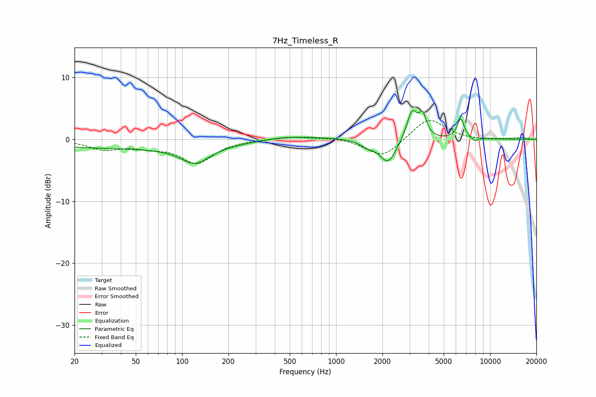

# 7Hz_Timeless_R
See [usage instructions](https://github.com/jaakkopasanen/AutoEq#usage) for more options and info.

### Parametric EQs
Apply preamp of -4.8 dB when using parametric equalizer.

|   # | Type    |   Fc (Hz) |    Q |   Gain (dB) |
|-----|---------|-----------|------|-------------|
|   1 | Peaking |        50 | 0.18 |        -1.4 |
|   2 | Peaking |       121 | 1.54 |        -2.7 |
|   3 | Peaking |       505 | 0.62 |         0.7 |
|   4 | Peaking |      1603 | 3.17 |        -0.9 |
|   5 | Peaking |      2179 | 2.64 |        -3.9 |
|   6 | Peaking |      3116 | 4.07 |         4.7 |
|   7 | Peaking |      3659 | 5.99 |         3.2 |
|   8 | Peaking |      6452 | 6    |         3.2 |
|   9 | Peaking |      7986 | 5.55 |        -1.2 |
|  10 | Peaking |      8032 | 4.39 |         0.7 |

### Fixed Band EQs
When using fixed band (also called graphic) equalizer, apply preamp of **-3.1 dB** (if available) and set gains manually with these parameters.

|   # | Type    |   Fc (Hz) |    Q |   Gain (dB) |
|-----|---------|-----------|------|-------------|
|   1 | Peaking |        31 | 1.41 |        -1.5 |
|   2 | Peaking |        62 | 1.41 |        -0.9 |
|   3 | Peaking |       125 | 1.41 |        -3.7 |
|   4 | Peaking |       250 | 1.41 |        -0   |
|   5 | Peaking |       500 | 1.41 |         0.5 |
|   6 | Peaking |      1000 | 1.41 |         0.3 |
|   7 | Peaking |      2000 | 1.41 |        -3   |
|   8 | Peaking |      4000 | 1.41 |         3.5 |
|   9 | Peaking |      8000 | 1.41 |        -0.2 |
|  10 | Peaking |     16000 | 1.41 |         0.2 |

### Graphs

