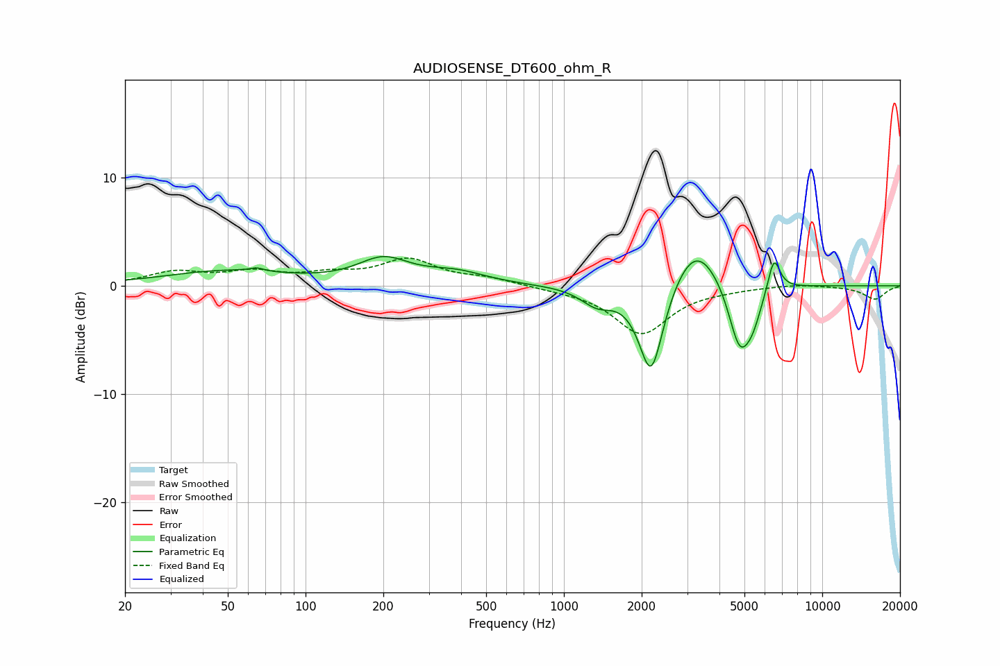

# AUDIOSENSE_DT600_ohm_R
See [usage instructions](https://github.com/jaakkopasanen/AutoEq#usage) for more options and info.

### Parametric EQs
Apply preamp of -2.8 dB when using parametric equalizer.

|   # | Type    |   Fc (Hz) |    Q |   Gain (dB) |
|-----|---------|-----------|------|-------------|
|   1 | Peaking |        49 | 0.61 |         1.3 |
|   2 | Peaking |        65 | 5.61 |         0.3 |
|   3 | Peaking |       200 | 1.42 |         2.2 |
|   4 | Peaking |       381 | 1.19 |         1.1 |
|   5 | Peaking |      1346 | 2.22 |        -1.6 |
|   6 | Peaking |      2177 | 2.87 |        -8.9 |
|   7 | Peaking |      3226 | 1.46 |         4.6 |
|   8 | Peaking |      4777 | 3.15 |        -5.9 |
|   9 | Peaking |      5372 | 3.64 |        -2.4 |
|  10 | Peaking |      6498 | 5.66 |         3.3 |

### Fixed Band EQs
When using fixed band (also called graphic) equalizer, apply preamp of **-2.7 dB** (if available) and set gains manually with these parameters.

|   # | Type    |   Fc (Hz) |    Q |   Gain (dB) |
|-----|---------|-----------|------|-------------|
|   1 | Peaking |        31 | 1.41 |         1.2 |
|   2 | Peaking |        62 | 1.41 |         1.1 |
|   3 | Peaking |       125 | 1.41 |         0.8 |
|   4 | Peaking |       250 | 1.41 |         2.3 |
|   5 | Peaking |       500 | 1.41 |         0.6 |
|   6 | Peaking |      1000 | 1.41 |        -0.2 |
|   7 | Peaking |      2000 | 1.41 |        -4.4 |
|   8 | Peaking |      4000 | 1.41 |        -0.2 |
|   9 | Peaking |      8000 | 1.41 |         0.2 |
|  10 | Peaking |     16000 | 1.41 |        -1.2 |

### Graphs

