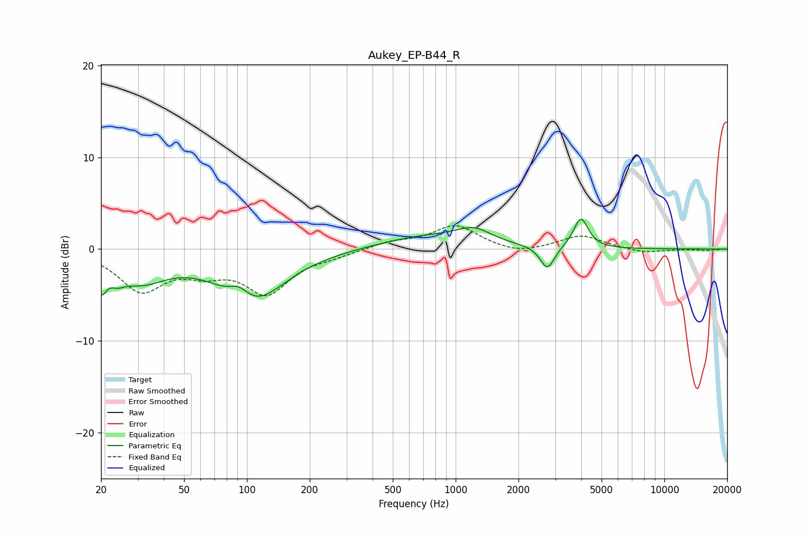

# Aukey_EP-B44_R
See [usage instructions](https://github.com/jaakkopasanen/AutoEq#usage) for more options and info.

### Parametric EQs
Apply preamp of -3.3 dB when using parametric equalizer.

|   # | Type    |   Fc (Hz) |    Q |   Gain (dB) |
|-----|---------|-----------|------|-------------|
|   1 | Peaking |        20 | 5.61 |        -2.8 |
|   2 | Peaking |        24 | 3.89 |        -1   |
|   3 | Peaking |        31 | 1.1  |        -3.1 |
|   4 | Peaking |        92 | 2.81 |         1.6 |
|   5 | Peaking |        95 | 1.12 |        -1   |
|   6 | Peaking |       107 | 0.89 |        -4.9 |
|   7 | Peaking |       713 | 0.65 |         1.3 |
|   8 | Peaking |      1224 | 1.66 |         1.5 |
|   9 | Peaking |      2752 | 4.18 |        -2.6 |
|  10 | Peaking |      3981 | 4.07 |         3.3 |

### Fixed Band EQs
When using fixed band (also called graphic) equalizer, apply preamp of **-2.6 dB** (if available) and set gains manually with these parameters.

|   # | Type    |   Fc (Hz) |    Q |   Gain (dB) |
|-----|---------|-----------|------|-------------|
|   1 | Peaking |        31 | 1.41 |        -4.3 |
|   2 | Peaking |        62 | 1.41 |        -1.9 |
|   3 | Peaking |       125 | 1.41 |        -4.5 |
|   4 | Peaking |       250 | 1.41 |        -0.6 |
|   5 | Peaking |       500 | 1.41 |         0.7 |
|   6 | Peaking |      1000 | 1.41 |         2.5 |
|   7 | Peaking |      2000 | 1.41 |        -0.6 |
|   8 | Peaking |      4000 | 1.41 |         1.5 |
|   9 | Peaking |      8000 | 1.41 |        -0.5 |
|  10 | Peaking |     16000 | 1.41 |        -0.1 |

### Graphs

