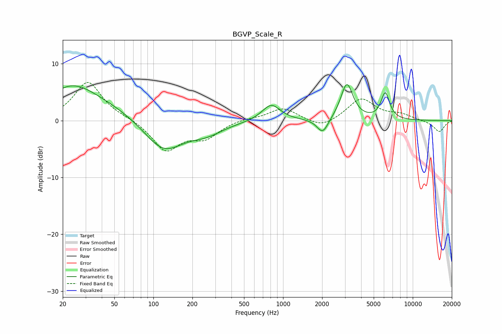

# BGVP_Scale_R
See [usage instructions](https://github.com/jaakkopasanen/AutoEq#usage) for more options and info.

### Parametric EQs
Apply preamp of -6.5 dB when using parametric equalizer.

|   # | Type    |   Fc (Hz) |    Q |   Gain (dB) |
|-----|---------|-----------|------|-------------|
|   1 | Peaking |        20 | 6    |        -3.5 |
|   2 | Peaking |        20 | 5.85 |         3.3 |
|   3 | Peaking |        22 | 0.38 |         5.2 |
|   4 | Peaking |        26 | 1.21 |         1.3 |
|   5 | Peaking |       120 | 0.93 |        -5.6 |
|   6 | Peaking |       258 | 1.1  |        -1.7 |
|   7 | Peaking |       810 | 2    |         2.9 |
|   8 | Peaking |      2022 | 3.25 |        -2.7 |
|   9 | Peaking |      3104 | 2.99 |         6.5 |
|  10 | Peaking |      6140 | 4.17 |         4.6 |

### Fixed Band EQs
When using fixed band (also called graphic) equalizer, apply preamp of **-6.8 dB** (if available) and set gains manually with these parameters.

|   # | Type    |   Fc (Hz) |    Q |   Gain (dB) |
|-----|---------|-----------|------|-------------|
|   1 | Peaking |        31 | 1.41 |         6.9 |
|   2 | Peaking |        62 | 1.41 |         0.4 |
|   3 | Peaking |       125 | 1.41 |        -5.2 |
|   4 | Peaking |       250 | 1.41 |        -2.7 |
|   5 | Peaking |       500 | 1.41 |         0.4 |
|   6 | Peaking |      1000 | 1.41 |         2.2 |
|   7 | Peaking |      2000 | 1.41 |        -1.5 |
|   8 | Peaking |      4000 | 1.41 |         3.9 |
|   9 | Peaking |      8000 | 1.41 |         1   |
|  10 | Peaking |     16000 | 1.41 |        -2   |

### Graphs

