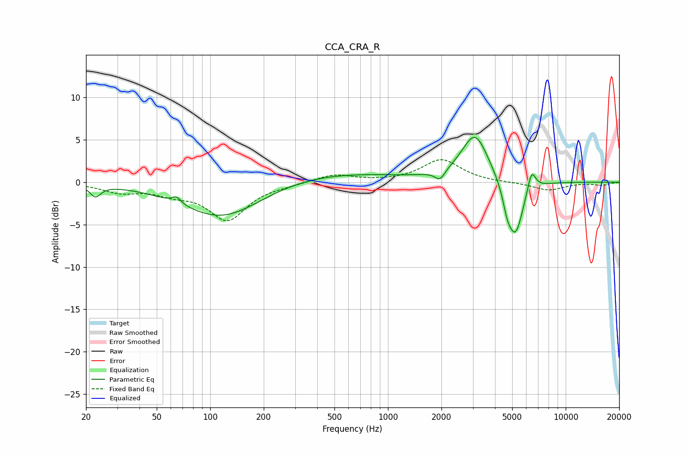

# CCA_CRA_R
See [usage instructions](https://github.com/jaakkopasanen/AutoEq#usage) for more options and info.

### Parametric EQs
Apply preamp of -5.4 dB when using parametric equalizer.

|   # | Type    |   Fc (Hz) |    Q |   Gain (dB) |
|-----|---------|-----------|------|-------------|
|   1 | Peaking |        23 | 4.78 |        -1.3 |
|   2 | Peaking |        65 | 5.88 |         0.8 |
|   3 | Peaking |       118 | 0.61 |        -4.9 |
|   4 | Peaking |       324 | 0.28 |         1.4 |
|   5 | Peaking |      1963 | 5.14 |        -1.2 |
|   6 | Peaking |      3087 | 1.79 |         5.3 |
|   7 | Peaking |      3121 | 2.88 |         0.4 |
|   8 | Peaking |      4684 | 5.98 |        -1.7 |
|   9 | Peaking |      5207 | 3.05 |        -6.7 |
|  10 | Peaking |      6427 | 5.92 |         2.5 |

### Fixed Band EQs
When using fixed band (also called graphic) equalizer, apply preamp of **-2.7 dB** (if available) and set gains manually with these parameters.

|   # | Type    |   Fc (Hz) |    Q |   Gain (dB) |
|-----|---------|-----------|------|-------------|
|   1 | Peaking |        31 | 1.41 |        -1.1 |
|   2 | Peaking |        62 | 1.41 |        -1   |
|   3 | Peaking |       125 | 1.41 |        -4.3 |
|   4 | Peaking |       250 | 1.41 |        -0.2 |
|   5 | Peaking |       500 | 1.41 |         0.9 |
|   6 | Peaking |      1000 | 1.41 |         0   |
|   7 | Peaking |      2000 | 1.41 |         2.7 |
|   8 | Peaking |      4000 | 1.41 |        -0   |
|   9 | Peaking |      8000 | 1.41 |        -1   |
|  10 | Peaking |     16000 | 1.41 |        -0.3 |

### Graphs

