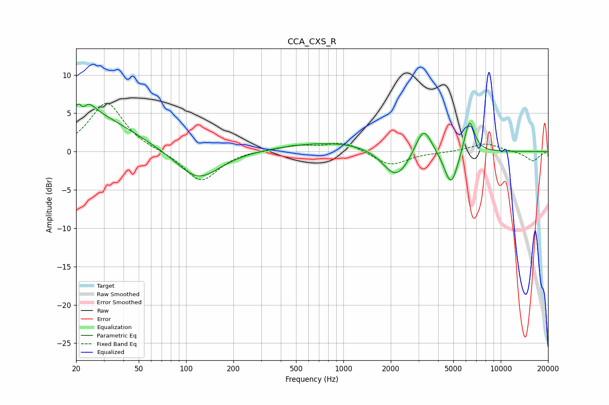

# CCA_CXS_R
See [usage instructions](https://github.com/jaakkopasanen/AutoEq#usage) for more options and info.

### Parametric EQs
Apply preamp of -6.3 dB when using parametric equalizer.

|   # | Type    |   Fc (Hz) |    Q |   Gain (dB) |
|-----|---------|-----------|------|-------------|
|   1 | Peaking |        21 | 5.99 |         3.2 |
|   2 | Peaking |        22 | 5.82 |        -3.3 |
|   3 | Peaking |        23 | 0.53 |         5   |
|   4 | Peaking |        23 | 3.04 |         1.6 |
|   5 | Peaking |       119 | 1.03 |        -4   |
|   6 | Peaking |       972 | 0.38 |         1.4 |
|   7 | Peaking |      2165 | 1.61 |        -4.2 |
|   8 | Peaking |      3230 | 2.77 |         3.7 |
|   9 | Peaking |      4833 | 3.18 |        -4.8 |
|  10 | Peaking |      6323 | 4.2  |         4.6 |

### Fixed Band EQs
When using fixed band (also called graphic) equalizer, apply preamp of **-6.4 dB** (if available) and set gains manually with these parameters.

|   # | Type    |   Fc (Hz) |    Q |   Gain (dB) |
|-----|---------|-----------|------|-------------|
|   1 | Peaking |        31 | 1.41 |         6.4 |
|   2 | Peaking |        62 | 1.41 |         0   |
|   3 | Peaking |       125 | 1.41 |        -4   |
|   4 | Peaking |       250 | 1.41 |         0.2 |
|   5 | Peaking |       500 | 1.41 |         0.8 |
|   6 | Peaking |      1000 | 1.41 |         1.3 |
|   7 | Peaking |      2000 | 1.41 |        -1.9 |
|   8 | Peaking |      4000 | 1.41 |        -0.1 |
|   9 | Peaking |      8000 | 1.41 |         1.1 |
|  10 | Peaking |     16000 | 1.41 |        -1.3 |

### Graphs

