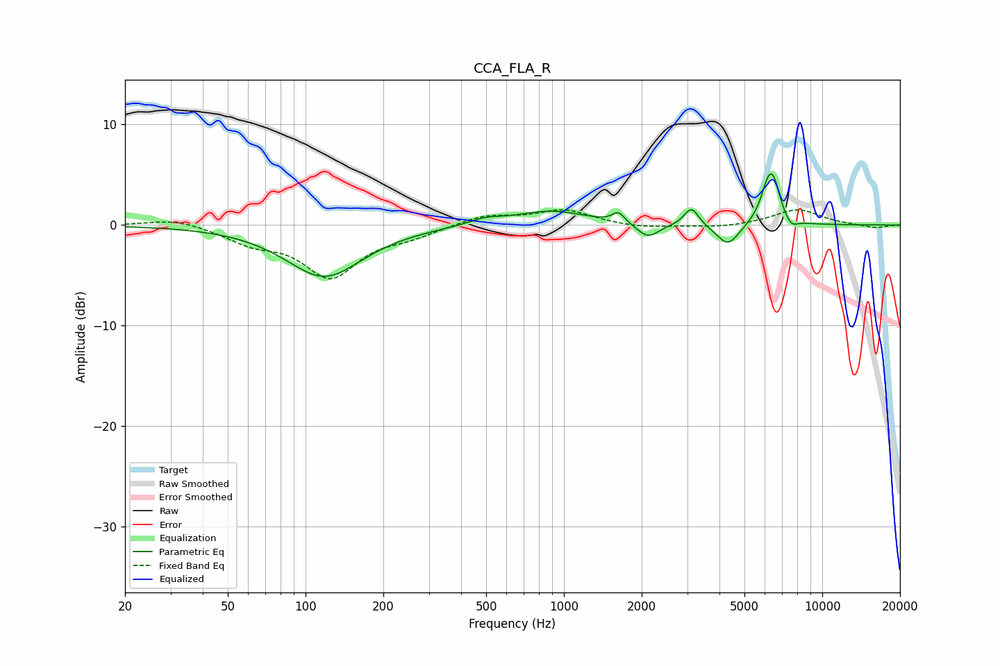

# CCA_FLA_R
See [usage instructions](https://github.com/jaakkopasanen/AutoEq#usage) for more options and info.

### Parametric EQs
Apply preamp of -5.2 dB when using parametric equalizer.

|   # | Type    |   Fc (Hz) |    Q |   Gain (dB) |
|-----|---------|-----------|------|-------------|
|   1 | Peaking |       118 | 0.96 |        -5.1 |
|   2 | Peaking |       497 | 2.18 |         0.6 |
|   3 | Peaking |       890 | 1.03 |         1.4 |
|   4 | Peaking |      1628 | 6    |         1   |
|   5 | Peaking |      2119 | 3.37 |        -1.4 |
|   6 | Peaking |      3116 | 5.09 |         1.8 |
|   7 | Peaking |      4317 | 3.21 |        -2.2 |
|   8 | Peaking |      6230 | 4.36 |         4.3 |
|   9 | Peaking |      6559 | 5.92 |         1.5 |
|  10 | Peaking |      7584 | 5.55 |        -0.8 |

### Fixed Band EQs
When using fixed band (also called graphic) equalizer, apply preamp of **-1.6 dB** (if available) and set gains manually with these parameters.

|   # | Type    |   Fc (Hz) |    Q |   Gain (dB) |
|-----|---------|-----------|------|-------------|
|   1 | Peaking |        31 | 1.41 |         0.7 |
|   2 | Peaking |        62 | 1.41 |        -1.5 |
|   3 | Peaking |       125 | 1.41 |        -5   |
|   4 | Peaking |       250 | 1.41 |        -0.9 |
|   5 | Peaking |       500 | 1.41 |         1   |
|   6 | Peaking |      1000 | 1.41 |         1.5 |
|   7 | Peaking |      2000 | 1.41 |        -0.3 |
|   8 | Peaking |      4000 | 1.41 |        -0.3 |
|   9 | Peaking |      8000 | 1.41 |         1.6 |
|  10 | Peaking |     16000 | 1.41 |        -0.3 |

### Graphs

