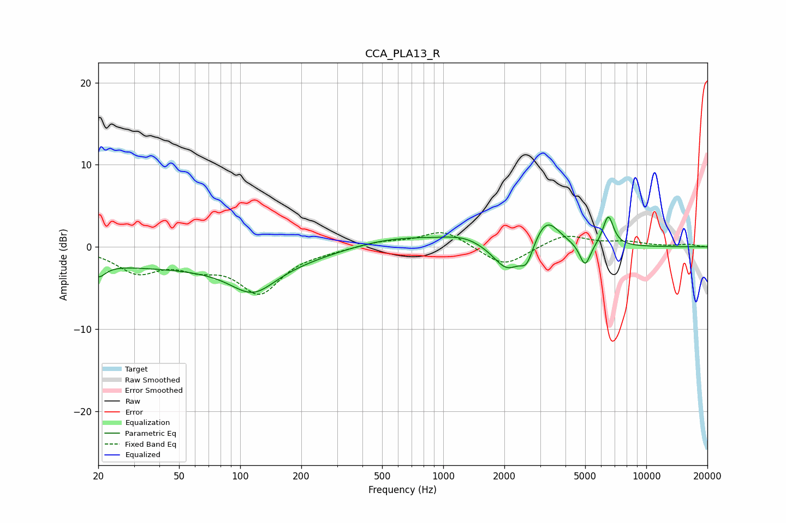

# CCA_PLA13_R
See [usage instructions](https://github.com/jaakkopasanen/AutoEq#usage) for more options and info.

### Parametric EQs
Apply preamp of -3.7 dB when using parametric equalizer.

|   # | Type    |   Fc (Hz) |    Q |   Gain (dB) |
|-----|---------|-----------|------|-------------|
|   1 | Peaking |        20 | 4.06 |        -1.6 |
|   2 | Peaking |        62 | 0.18 |        -2.5 |
|   3 | Peaking |       116 | 1.28 |        -3.4 |
|   4 | Peaking |       557 | 0.51 |         1.6 |
|   5 | Peaking |      1274 | 1.43 |         0.8 |
|   6 | Peaking |      2068 | 2.03 |        -3.3 |
|   7 | Peaking |      2579 | 4.54 |        -2.3 |
|   8 | Peaking |      3222 | 2.21 |         3.6 |
|   9 | Peaking |      4995 | 5.25 |        -2.9 |
|  10 | Peaking |      6499 | 5.19 |         3.7 |

### Fixed Band EQs
When using fixed band (also called graphic) equalizer, apply preamp of **-1.8 dB** (if available) and set gains manually with these parameters.

|   # | Type    |   Fc (Hz) |    Q |   Gain (dB) |
|-----|---------|-----------|------|-------------|
|   1 | Peaking |        31 | 1.41 |        -2.9 |
|   2 | Peaking |        62 | 1.41 |        -1.8 |
|   3 | Peaking |       125 | 1.41 |        -5.3 |
|   4 | Peaking |       250 | 1.41 |        -0.3 |
|   5 | Peaking |       500 | 1.41 |         0.6 |
|   6 | Peaking |      1000 | 1.41 |         2   |
|   7 | Peaking |      2000 | 1.41 |        -2.5 |
|   8 | Peaking |      4000 | 1.41 |         1.5 |
|   9 | Peaking |      8000 | 1.41 |         0.5 |
|  10 | Peaking |     16000 | 1.41 |         0.3 |

### Graphs

