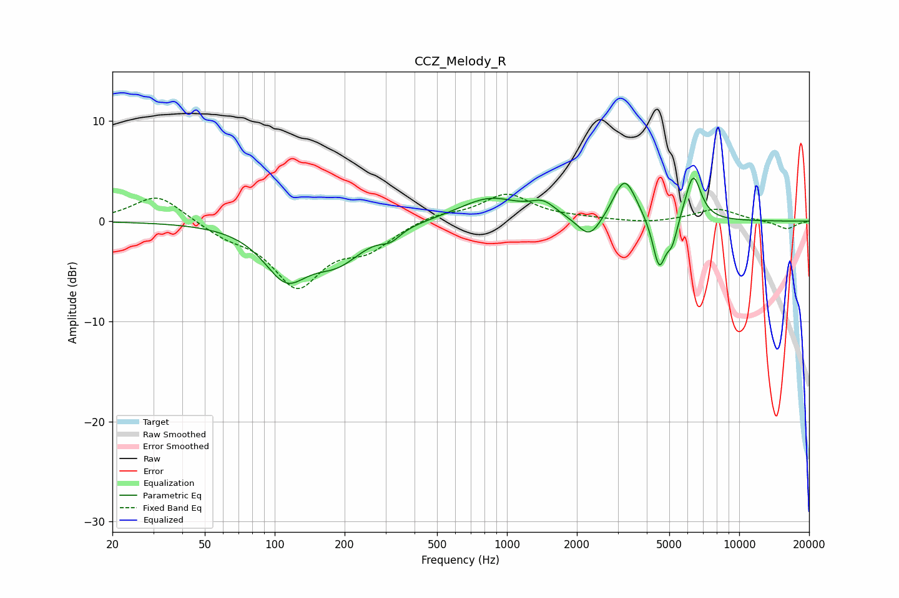

# CCZ_Melody_R
See [usage instructions](https://github.com/jaakkopasanen/AutoEq#usage) for more options and info.

### Parametric EQs
Apply preamp of -4.4 dB when using parametric equalizer.

|   # | Type    |   Fc (Hz) |    Q |   Gain (dB) |
|-----|---------|-----------|------|-------------|
|   1 | Peaking |       112 | 1.49 |        -5   |
|   2 | Peaking |       187 | 1.25 |        -3.3 |
|   3 | Peaking |       316 | 3.38 |        -1   |
|   4 | Peaking |       842 | 1.06 |         2.3 |
|   5 | Peaking |      1434 | 2.62 |         1.3 |
|   6 | Peaking |      2269 | 2.74 |        -2.3 |
|   7 | Peaking |      3213 | 2.83 |         4.4 |
|   8 | Peaking |      4522 | 4.97 |        -5   |
|   9 | Peaking |      5149 | 5.93 |        -2.2 |
|  10 | Peaking |      6333 | 4.03 |         4.7 |

### Fixed Band EQs
When using fixed band (also called graphic) equalizer, apply preamp of **-2.8 dB** (if available) and set gains manually with these parameters.

|   # | Type    |   Fc (Hz) |    Q |   Gain (dB) |
|-----|---------|-----------|------|-------------|
|   1 | Peaking |        31 | 1.41 |         2.7 |
|   2 | Peaking |        62 | 1.41 |        -1.2 |
|   3 | Peaking |       125 | 1.41 |        -6.2 |
|   4 | Peaking |       250 | 1.41 |        -2.4 |
|   5 | Peaking |       500 | 1.41 |         0.7 |
|   6 | Peaking |      1000 | 1.41 |         2.7 |
|   7 | Peaking |      2000 | 1.41 |         0.2 |
|   8 | Peaking |      4000 | 1.41 |        -0.2 |
|   9 | Peaking |      8000 | 1.41 |         1.2 |
|  10 | Peaking |     16000 | 1.41 |        -0.8 |

### Graphs

